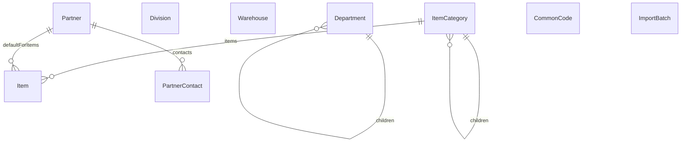
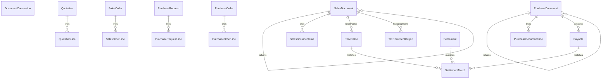
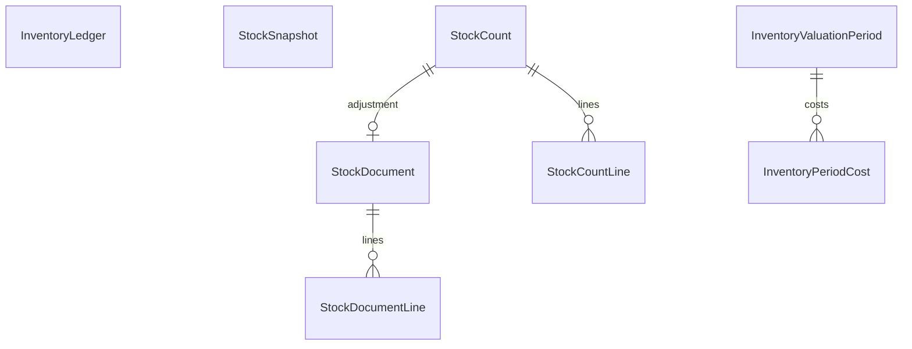
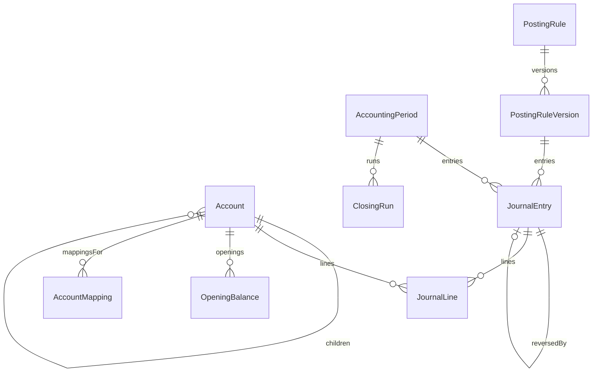
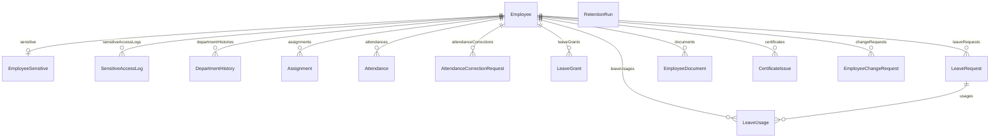
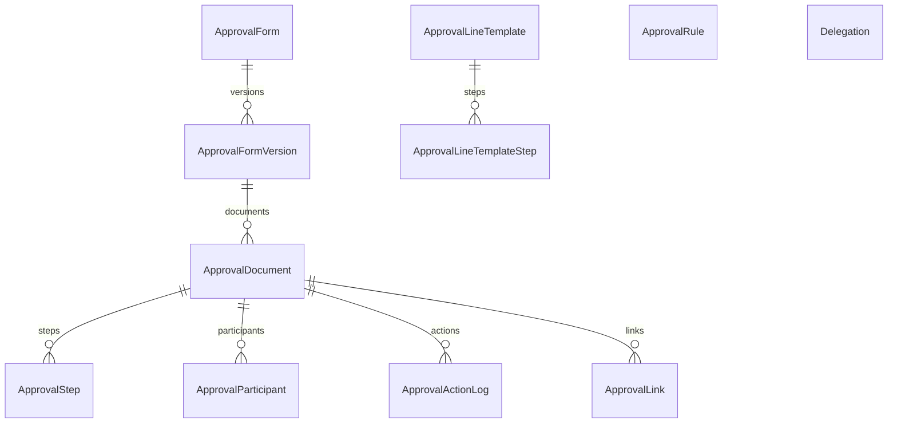
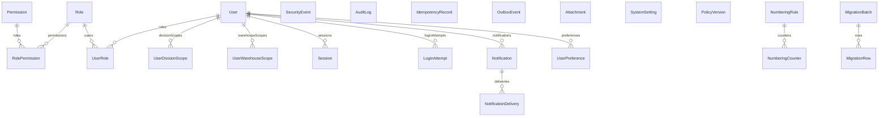

# 데이터 모델 (Data Model)

> 생성: `node tools/docs-schema.mjs` — 원본은 `prisma/schema.prisma`. 이 파일을 직접 편집하지 않는다.
> 민감정보 표시는 `src/server/modules/migration/templates.ts`의 `sensitive: true` 컬럼과 스키마 자체 주석(NFR-SEC-06)에서만 가져온다 — 추정하지 않는다.

모델 수: 92 · 생성 시각: 2026-08-31T07:06:26.942Z

## 도메인

| 도메인                | 모델 수 | 모델                                                                                                                                                                                                                                                                                                                                                                               |
| --------------------- | ------- | ---------------------------------------------------------------------------------------------------------------------------------------------------------------------------------------------------------------------------------------------------------------------------------------------------------------------------------------------------------------------------------- |
| 마스터데이터 (Master) | 9       | `Department`, `Division`, `Warehouse`, `ItemCategory`, `Item`, `Partner`, `PartnerContact`, `CommonCode`, `ImportBatch`                                                                                                                                                                                                                                                            |
| 영업/구매 (Sales)     | 18      | `DocumentConversion`, `Quotation`, `QuotationLine`, `SalesOrder`, `SalesOrderLine`, `SalesDocument`, `SalesDocumentLine`, `PurchaseRequest`, `PurchaseRequestLine`, `PurchaseOrder`, `PurchaseOrderLine`, `PurchaseDocument`, `PurchaseDocumentLine`, `Receivable`, `Payable`, `Settlement`, `SettlementMatch`, `TaxDocumentOutput`                                                |
| 재고 (Inventory)      | 8       | `StockDocument`, `StockDocumentLine`, `InventoryLedger`, `StockSnapshot`, `StockCount`, `StockCountLine`, `InventoryValuationPeriod`, `InventoryPeriodCost`                                                                                                                                                                                                                        |
| 회계 (Accounting)     | 9       | `Account`, `AccountMapping`, `AccountingPeriod`, `JournalEntry`, `JournalLine`, `PostingRule`, `PostingRuleVersion`, `OpeningBalance`, `ClosingRun`                                                                                                                                                                                                                                |
| 인사 (HR)             | 14      | `Employee`, `EmployeeSensitive`, `SensitiveAccessLog`, `DepartmentHistory`, `Assignment`, `Attendance`, `AttendanceCorrectionRequest`, `LeaveGrant`, `LeaveUsage`, `LeaveRequest`, `EmployeeDocument`, `CertificateIssue`, `EmployeeChangeRequest`, `RetentionRun`                                                                                                                 |
| 전자결재 (Approval)   | 11      | `ApprovalForm`, `ApprovalFormVersion`, `ApprovalLineTemplate`, `ApprovalLineTemplateStep`, `ApprovalRule`, `Delegation`, `ApprovalDocument`, `ApprovalStep`, `ApprovalParticipant`, `ApprovalActionLog`, `ApprovalLink`                                                                                                                                                            |
| 시스템/보안 (System)  | 23      | `User`, `Role`, `Permission`, `RolePermission`, `UserRole`, `UserDivisionScope`, `UserWarehouseScope`, `Session`, `LoginAttempt`, `SecurityEvent`, `AuditLog`, `IdempotencyRecord`, `OutboxEvent`, `Notification`, `NotificationDelivery`, `Attachment`, `SystemSetting`, `PolicyVersion`, `UserPreference`, `NumberingRule`, `NumberingCounter`, `MigrationBatch`, `MigrationRow` |

## 도메인별 ERD

전체 92개 모델을 한 다이어그램에 그리면 읽을 수 없어, 요구사항대로 도메인별로 나눈다. 도메인 간 관계는 다이어그램에 넣지 않고 각 모델의 "관계" 목록에서 대상 모델명으로 알아볼 수 있게 남긴다.

### 마스터데이터 (Master)

### 영업/구매 (Sales)

### 재고 (Inventory)

### 회계 (Accounting)

### 인사 (HR)

### 전자결재 (Approval)

### 시스템/보안 (System)

## 모델별 테이블 정의

### 마스터데이터 (Master)

#### Department

| 컬럼             | 타입     | Null허용 | 기본값   | 제약/인덱스     | 민감정보 | 설명 |
| ---------------- | -------- | -------- | -------- | --------------- | -------- | ---- |
| `id`             | String   | N        | `cuid()` | PK              | —        | —    |
| `code`           | String   | N        | —        | UNIQUE          | —        | —    |
| `name`           | String   | N        | —        | —               | —        | —    |
| `parentId`       | String   | Y        | —        | INDEX(parentId) | —        | —    |
| `headEmployeeId` | String   | Y        | —        | —               | —        | —    |
| `validFrom`      | Date     | N        | —        | —               | —        | —    |
| `validTo`        | Date     | Y        | —        | —               | —        | —    |
| `sortOrder`      | Int      | N        | `0`      | —               | —        | —    |
| `isActive`       | Boolean  | N        | `true`   | —               | —        | —    |
| `createdAt`      | DateTime | N        | `now()`  | —               | —        | —    |
| `updatedAt`      | DateTime | N        | —        | auto: updatedAt | —        | —    |

관계:

- `parent` → **Department** [N:1] (FK: `parentId` → `Department.id`)
- `children` → **Department** [1:N] (역참조, FK 없음)
- `employees` → **Employee** [1:N] (역참조, FK 없음)
- `histories` → **DepartmentHistory** [1:N] (역참조, FK 없음)
- `assignments` → **Assignment** [1:N] (역참조, FK 없음)

#### Division

| 컬럼        | 타입     | Null허용 | 기본값   | 제약/인덱스     | 민감정보 | 설명 |
| ----------- | -------- | -------- | -------- | --------------- | -------- | ---- |
| `id`        | String   | N        | `cuid()` | PK              | —        | —    |
| `code`      | String   | N        | —        | UNIQUE          | —        | —    |
| `name`      | String   | N        | —        | —               | —        | —    |
| `isActive`  | Boolean  | N        | `true`   | —               | —        | —    |
| `sortOrder` | Int      | N        | `0`      | —               | —        | —    |
| `createdAt` | DateTime | N        | `now()`  | —               | —        | —    |
| `updatedAt` | DateTime | N        | —        | auto: updatedAt | —        | —    |

관계:

- `userScopes` → **UserDivisionScope** [1:N] (역참조, FK 없음)
- `stockDocuments` → **StockDocument** [1:N] (역참조, FK 없음)
- `journalLines` → **JournalLine** [1:N] (역참조, FK 없음)
- `quotations` → **Quotation** [1:N] (역참조, FK 없음)
- `salesOrders` → **SalesOrder** [1:N] (역참조, FK 없음)
- `salesDocuments` → **SalesDocument** [1:N] (역참조, FK 없음)
- `purchaseRequests` → **PurchaseRequest** [1:N] (역참조, FK 없음)
- `purchaseOrders` → **PurchaseOrder** [1:N] (역참조, FK 없음)
- `purchaseDocuments` → **PurchaseDocument** [1:N] (역참조, FK 없음)

#### Warehouse

| 컬럼                | 타입     | Null허용 | 기본값     | 제약/인덱스     | 민감정보 | 설명                          |
| ------------------- | -------- | -------- | ---------- | --------------- | -------- | ----------------------------- |
| `id`                | String   | N        | `cuid()`   | PK              | —        | —                             |
| `code`              | String   | N        | —          | UNIQUE          | —        | —                             |
| `name`              | String   | N        | —          | —               | —        | —                             |
| `type`              | String   | N        | `"NORMAL"` | —               | —        | NORMAL \| DEFECT \| CONSIGNED |
| `managerEmployeeId` | String   | Y        | —          | —               | —        | —                             |
| `address`           | String   | Y        | —          | —               | —        | —                             |
| `isActive`          | Boolean  | N        | `true`     | —               | —        | —                             |
| `sortOrder`         | Int      | N        | `0`        | —               | —        | —                             |
| `createdAt`         | DateTime | N        | `now()`    | —               | —        | —                             |
| `updatedAt`         | DateTime | N        | —          | auto: updatedAt | —        | —                             |

관계:

- `userScopes` → **UserWarehouseScope** [1:N] (역참조, FK 없음)
- `stockFrom` → **StockDocument** [1:N] (역참조, FK 없음)
- `stockTo` → **StockDocument** [1:N] (역참조, FK 없음)
- `salesDocuments` → **SalesDocument** [1:N] (역참조, FK 없음)
- `purchaseDocuments` → **PurchaseDocument** [1:N] (역참조, FK 없음)
- `ledger` → **InventoryLedger** [1:N] (역참조, FK 없음)
- `snapshots` → **StockSnapshot** [1:N] (역참조, FK 없음)
- `counts` → **StockCount** [1:N] (역참조, FK 없음)

#### ItemCategory

| 컬럼        | 타입     | Null허용 | 기본값   | 제약/인덱스     | 민감정보 | 설명                                                          |
| ----------- | -------- | -------- | -------- | --------------- | -------- | ------------------------------------------------------------- |
| `id`        | String   | N        | `cuid()` | PK              | —        | —                                                             |
| `code`      | String   | N        | —        | UNIQUE          | —        | —                                                             |
| `name`      | String   | N        | —        | —               | —        | —                                                             |
| `level`     | Int      | N        | —        | INDEX(level)    | —        | 1..3 — the RFP requires a three-level classification (BAS-01) |
| `parentId`  | String   | Y        | —        | INDEX(parentId) | —        | —                                                             |
| `isActive`  | Boolean  | N        | `true`   | —               | —        | —                                                             |
| `sortOrder` | Int      | N        | `0`      | —               | —        | —                                                             |
| `createdAt` | DateTime | N        | `now()`  | —               | —        | —                                                             |
| `updatedAt` | DateTime | N        | —        | auto: updatedAt | —        | —                                                             |

관계:

- `parent` → **ItemCategory** [N:1] (FK: `parentId` → `ItemCategory.id`)
- `children` → **ItemCategory** [1:N] (역참조, FK 없음)
- `items` → **Item** [1:N] (역참조, FK 없음)

#### Item

| 컬럼                | 타입           | Null허용 | 기본값      | 제약/인덱스       | 민감정보 | 설명                      |
| ------------------- | -------------- | -------- | ----------- | ----------------- | -------- | ------------------------- |
| `id`                | String         | N        | `cuid()`    | PK                | —        | —                         |
| `code`              | String         | N        | —           | UNIQUE            | —        | —                         |
| `name`              | String         | N        | —           | INDEX(name)       | —        | —                         |
| `spec`              | String         | Y        | —           | —                 | —        | —                         |
| `unitCode`          | String         | N        | `"EA"`      | —                 | —        | —                         |
| `categoryId`        | String         | Y        | —           | INDEX(categoryId) | —        | —                         |
| `purchasePrice`     | Decimal(18, 4) | Y        | —           | —                 | —        | —                         |
| `salesPrice`        | Decimal(18, 4) | Y        | —           | —                 | —        | —                         |
| `taxType`           | String         | N        | `"TAXABLE"` | —                 | —        | TAXABLE \| ZERO \| EXEMPT |
| `barcode`           | String         | Y        | —           | —                 | —        | —                         |
| `safetyStock`       | Decimal(18, 3) | Y        | —           | —                 | —        | BAS-02 supplementary      |
| `leadTimeDays`      | Int            | Y        | —           | —                 | —        | —                         |
| `defaultSupplierId` | String         | Y        | —           | —                 | —        | —                         |
| `imageAttachmentId` | String         | Y        | —           | —                 | —        | —                         |
| `note`              | String         | Y        | —           | —                 | —        | —                         |
| `isActive`          | Boolean        | N        | `true`      | INDEX(isActive)   | —        | —                         |
| `version`           | Int            | N        | `1`         | —                 | —        | —                         |
| `createdAt`         | DateTime       | N        | `now()`     | —                 | —        | —                         |
| `updatedAt`         | DateTime       | N        | —           | auto: updatedAt   | —        | —                         |

관계:

- `category` → **ItemCategory** [N:1] (FK: `categoryId` → `ItemCategory.id`)
- `defaultSupplier` → **Partner** [N:1] (FK: `defaultSupplierId` → `Partner.id`)
- `stockLines` → **StockDocumentLine** [1:N] (역참조, FK 없음)
- `quotationLines` → **QuotationLine** [1:N] (역참조, FK 없음)
- `salesOrderLines` → **SalesOrderLine** [1:N] (역참조, FK 없음)
- `salesDocumentLines` → **SalesDocumentLine** [1:N] (역참조, FK 없음)
- `purchaseRequestLines` → **PurchaseRequestLine** [1:N] (역참조, FK 없음)
- `purchaseOrderLines` → **PurchaseOrderLine** [1:N] (역참조, FK 없음)
- `purchaseDocumentLines` → **PurchaseDocumentLine** [1:N] (역참조, FK 없음)
- `ledger` → **InventoryLedger** [1:N] (역참조, FK 없음)
- `snapshots` → **StockSnapshot** [1:N] (역참조, FK 없음)
- `countLines` → **StockCountLine** [1:N] (역참조, FK 없음)
- `periodCosts` → **InventoryPeriodCost** [1:N] (역참조, FK 없음)

#### Partner

| 컬럼           | 타입           | Null허용 | 기본값   | 제약/인덱스                 | 민감정보 | 설명                         |
| -------------- | -------------- | -------- | -------- | --------------------------- | -------- | ---------------------------- |
| `id`           | String         | N        | `cuid()` | PK                          | —        | —                            |
| `code`         | String         | N        | —        | UNIQUE                      | —        | —                            |
| `name`         | String         | N        | —        | INDEX(name)                 | —        | —                            |
| `businessNo`   | String         | Y        | —        | INDEX(businessNo)           | —        | —                            |
| `ceoName`      | String         | Y        | —        | —                           | —        | —                            |
| `businessType` | String         | Y        | —        | —                           | —        | 업태                         |
| `businessItem` | String         | Y        | —        | —                           | —        | 종목                         |
| `address`      | String         | Y        | —        | —                           | —        | —                            |
| `phone`        | String         | Y        | —        | —                           | —        | —                            |
| `email`        | String         | Y        | —        | —                           | —        | —                            |
| `partnerType`  | String         | N        | `"BOTH"` | INDEX(partnerType+isActive) | —        | CUSTOMER \| SUPPLIER \| BOTH |
| `paymentTerms` | String         | Y        | —        | —                           | —        | —                            |
| `creditLimit`  | Decimal(18, 0) | Y        | —        | —                           | —        | —                            |
| `note`         | String         | Y        | —        | —                           | —        | —                            |
| `isActive`     | Boolean        | N        | `true`   | INDEX(partnerType+isActive) | —        | —                            |
| `version`      | Int            | N        | `1`      | —                           | —        | —                            |
| `createdAt`    | DateTime       | N        | `now()`  | —                           | —        | —                            |
| `updatedAt`    | DateTime       | N        | —        | auto: updatedAt             | —        | —                            |

관계:

- `contacts` → **PartnerContact** [1:N] (역참조, FK 없음)
- `defaultForItems` → **Item** [1:N] (역참조, FK 없음)
- `stockDocuments` → **StockDocument** [1:N] (역참조, FK 없음)
- `journalLines` → **JournalLine** [1:N] (역참조, FK 없음)
- `quotations` → **Quotation** [1:N] (역참조, FK 없음)
- `salesOrders` → **SalesOrder** [1:N] (역참조, FK 없음)
- `salesDocuments` → **SalesDocument** [1:N] (역참조, FK 없음)
- `purchaseOrders` → **PurchaseOrder** [1:N] (역참조, FK 없음)
- `purchaseDocuments` → **PurchaseDocument** [1:N] (역참조, FK 없음)
- `receivables` → **Receivable** [1:N] (역참조, FK 없음)
- `payables` → **Payable** [1:N] (역참조, FK 없음)
- `settlements` → **Settlement** [1:N] (역참조, FK 없음)

#### PartnerContact

| 컬럼        | 타입    | Null허용 | 기본값   | 제약/인덱스      | 민감정보 | 설명 |
| ----------- | ------- | -------- | -------- | ---------------- | -------- | ---- |
| `id`        | String  | N        | `cuid()` | PK               | —        | —    |
| `partnerId` | String  | N        | —        | INDEX(partnerId) | —        | —    |
| `name`      | String  | N        | —        | —                | —        | —    |
| `position`  | String  | Y        | —        | —                | —        | —    |
| `phone`     | String  | Y        | —        | —                | —        | —    |
| `email`     | String  | Y        | —        | —                | —        | —    |
| `isPrimary` | Boolean | N        | `false`  | —                | —        | —    |
| `note`      | String  | Y        | —        | —                | —        | —    |

관계:

- `partner` → **Partner** [N:1] (FK: `partnerId` → `Partner.id`)

#### CommonCode

| 컬럼        | 타입     | Null허용 | 기본값   | 제약/인덱스                                       | 민감정보 | 설명                                                       |
| ----------- | -------- | -------- | -------- | ------------------------------------------------- | -------- | ---------------------------------------------------------- |
| `id`        | String   | N        | `cuid()` | PK                                                | —        | —                                                          |
| `groupCode` | String   | N        | —        | UNIQUE(groupCode+code), INDEX(groupCode+isActive) | —        | UNIT \| ITEM_CATEGORY \| PAYMENT_METHOD \| POSITION \| ... |
| `code`      | String   | N        | —        | UNIQUE(groupCode+code)                            | —        | —                                                          |
| `name`      | String   | N        | —        | —                                                 | —        | —                                                          |
| `value1`    | String   | Y        | —        | —                                                 | —        | —                                                          |
| `value2`    | String   | Y        | —        | —                                                 | —        | —                                                          |
| `sortOrder` | Int      | N        | `0`      | —                                                 | —        | —                                                          |
| `isActive`  | Boolean  | N        | `true`   | INDEX(groupCode+isActive)                         | —        | —                                                          |
| `createdAt` | DateTime | N        | `now()`  | —                                                 | —        | —                                                          |
| `updatedAt` | DateTime | N        | —        | auto: updatedAt                                   | —        | —                                                          |

#### ImportBatch

BAS-03: every bulk upload is a batch, so errors and partial application are auditable.

| 컬럼              | 타입     | Null허용 | 기본값        | 제약/인덱스                 | 민감정보 | 설명                           |
| ----------------- | -------- | -------- | ------------- | --------------------------- | -------- | ------------------------------ |
| `id`              | String   | N        | `cuid()`      | PK                          | —        | —                              |
| `targetType`      | String   | N        | —             | INDEX(targetType+createdAt) | —        | ITEM \| PARTNER \| ...         |
| `templateVersion` | Int      | N        | `1`           | —                           | —        | —                              |
| `fileName`        | String   | Y        | —             | —                           | —        | —                              |
| `totalRows`       | Int      | N        | `0`           | —                           | —        | —                              |
| `validRows`       | Int      | N        | `0`           | —                           | —        | —                              |
| `errorRows`       | Int      | N        | `0`           | —                           | —        | —                              |
| `appliedRows`     | Int      | N        | `0`           | —                           | —        | —                              |
| `status`          | String   | N        | `"VALIDATED"` | —                           | —        | VALIDATED \| APPLIED \| FAILED |
| `errors`          | Json     | Y        | —             | —                           | —        | —                              |
| `createdById`     | String   | Y        | —             | —                           | —        | —                              |
| `createdAt`       | DateTime | N        | `now()`       | INDEX(targetType+createdAt) | —        | —                              |
| `appliedAt`       | DateTime | Y        | —             | —                           | —        | —                              |

### 영업/구매 (Sales)

#### DocumentConversion

SLS-02/SLS-04/SLS-13: partial conversion between documents.

Rather than each document type inventing its own "remaining quantity" field, every
conversion is recorded here against the SOURCE LINE. Remaining = original - converted

- canceled, derived from these rows, so two people converting the same quotation
  concurrently cannot both see the same remainder (the source line is locked first).

| 컬럼           | 타입           | Null허용 | 기본값   | 제약/인덱스                    | 민감정보 | 설명                                                                  |
| -------------- | -------------- | -------- | -------- | ------------------------------ | -------- | --------------------------------------------------------------------- |
| `id`           | String         | N        | `cuid()` | PK                             | —        | —                                                                     |
| `sourceType`   | String         | N        | —        | INDEX(sourceType+sourceId)     | —        | QUOTATION \| SALES_ORDER \| PURCHASE_REQUEST \| PURCHASE_ORDER        |
| `sourceId`     | String         | N        | —        | INDEX(sourceType+sourceId)     | —        | —                                                                     |
| `sourceLineId` | String         | N        | —        | INDEX(sourceLineId+canceledAt) | —        | —                                                                     |
| `targetType`   | String         | N        | —        | INDEX(targetType+targetId)     | —        | SALES_ORDER \| SALES \| PURCHASE_ORDER \| PURCHASE                    |
| `targetId`     | String         | N        | —        | INDEX(targetType+targetId)     | —        | —                                                                     |
| `targetLineId` | String         | N        | —        | UNIQUE                         | —        | —                                                                     |
| `quantity`     | Decimal(18, 3) | N        | —        | —                              | —        | —                                                                     |
| `canceledAt`   | DateTime       | Y        | —        | INDEX(sourceLineId+canceledAt) | —        | set when the target document is canceled, releasing the quantity back |
| `createdAt`    | DateTime       | N        | `now()`  | —                              | —        | —                                                                     |

#### Quotation

SLS-01: quotations.

| 컬럼              | 타입           | Null허용 | 기본값    | 제약/인덱스                                     | 민감정보 | 설명                                                   |
| ----------------- | -------------- | -------- | --------- | ----------------------------------------------- | -------- | ------------------------------------------------------ |
| `id`              | String         | N        | `cuid()`  | PK                                              | —        | —                                                      |
| `docNo`           | String         | N        | —         | UNIQUE                                          | —        | —                                                      |
| `docDate`         | Date           | N        | —         | INDEX(partnerId+docDate), INDEX(status+docDate) | —        | —                                                      |
| `validUntil`      | Date           | Y        | —         | —                                               | —        | —                                                      |
| `partnerId`       | String         | N        | —         | INDEX(partnerId+docDate)                        | —        | —                                                      |
| `divisionId`      | String         | Y        | —         | —                                               | —        | —                                                      |
| `status`          | String         | N        | `"DRAFT"` | INDEX(status+docDate)                           | —        | DRAFT \| CONFIRMED \| CONVERTED \| CANCELED \| EXPIRED |
| `title`           | String         | Y        | —         | —                                               | —        | —                                                      |
| `note`            | String         | Y        | —         | —                                               | —        | —                                                      |
| `supplyAmount`    | Decimal(18, 0) | N        | `0`       | —                                               | —        | —                                                      |
| `vatAmount`       | Decimal(18, 0) | N        | `0`       | —                                               | —        | —                                                      |
| `totalAmount`     | Decimal(18, 0) | N        | `0`       | —                                               | —        | —                                                      |
| `policyVersionId` | String         | Y        | —         | —                                               | —        | —                                                      |
| `version`         | Int            | N        | `1`       | —                                               | —        | —                                                      |
| `createdById`     | String         | Y        | —         | —                                               | —        | —                                                      |
| `createdAt`       | DateTime       | N        | `now()`   | —                                               | —        | —                                                      |
| `updatedAt`       | DateTime       | N        | —         | auto: updatedAt                                 | —        | —                                                      |

관계:

- `partner` → **Partner** [N:1] (FK: `partnerId` → `Partner.id`)
- `division` → **Division** [N:1] (FK: `divisionId` → `Division.id`)
- `lines` → **QuotationLine** [1:N] (역참조, FK 없음)

#### QuotationLine

| 컬럼           | 타입           | Null허용 | 기본값      | 제약/인덱스                | 민감정보 | 설명 |
| -------------- | -------------- | -------- | ----------- | -------------------------- | -------- | ---- |
| `id`           | String         | N        | `cuid()`    | PK                         | —        | —    |
| `quotationId`  | String         | N        | —           | UNIQUE(quotationId+lineNo) | —        | —    |
| `lineNo`       | Int            | N        | —           | UNIQUE(quotationId+lineNo) | —        | —    |
| `itemId`       | String         | N        | —           | INDEX(itemId)              | —        | —    |
| `description`  | String         | Y        | —           | —                          | —        | —    |
| `quantity`     | Decimal(18, 3) | N        | —           | —                          | —        | —    |
| `unitPrice`    | Decimal(18, 4) | N        | —           | —                          | —        | —    |
| `taxType`      | String         | N        | `"TAXABLE"` | —                          | —        | —    |
| `supplyAmount` | Decimal(18, 0) | N        | `0`         | —                          | —        | —    |
| `vatAmount`    | Decimal(18, 0) | N        | `0`         | —                          | —        | —    |

관계:

- `quotation` → **Quotation** [N:1] (FK: `quotationId` → `Quotation.id`)
- `item` → **Item** [N:1] (FK: `itemId` → `Item.id`)

#### SalesOrder

SLS-03: sales orders, with a delivery date and a lifecycle of their own.

| 컬럼              | 타입           | Null허용 | 기본값    | 제약/인덱스                | 민감정보 | 설명                                                      |
| ----------------- | -------------- | -------- | --------- | -------------------------- | -------- | --------------------------------------------------------- |
| `id`              | String         | N        | `cuid()`  | PK                         | —        | —                                                         |
| `docNo`           | String         | N        | —         | UNIQUE                     | —        | —                                                         |
| `docDate`         | Date           | N        | —         | INDEX(partnerId+docDate)   | —        | —                                                         |
| `deliveryDate`    | Date           | Y        | —         | INDEX(status+deliveryDate) | —        | —                                                         |
| `partnerId`       | String         | N        | —         | INDEX(partnerId+docDate)   | —        | —                                                         |
| `divisionId`      | String         | Y        | —         | —                          | —        | —                                                         |
| `status`          | String         | N        | `"DRAFT"` | INDEX(status+deliveryDate) | —        | DRAFT \| ACCEPTED \| IN_PROGRESS \| COMPLETED \| CANCELED |
| `note`            | String         | Y        | —         | —                          | —        | —                                                         |
| `supplyAmount`    | Decimal(18, 0) | N        | `0`       | —                          | —        | —                                                         |
| `vatAmount`       | Decimal(18, 0) | N        | `0`       | —                          | —        | —                                                         |
| `totalAmount`     | Decimal(18, 0) | N        | `0`       | —                          | —        | —                                                         |
| `policyVersionId` | String         | Y        | —         | —                          | —        | —                                                         |
| `version`         | Int            | N        | `1`       | —                          | —        | —                                                         |
| `createdById`     | String         | Y        | —         | —                          | —        | —                                                         |
| `createdAt`       | DateTime       | N        | `now()`   | —                          | —        | —                                                         |
| `updatedAt`       | DateTime       | N        | —         | auto: updatedAt            | —        | —                                                         |

관계:

- `partner` → **Partner** [N:1] (FK: `partnerId` → `Partner.id`)
- `division` → **Division** [N:1] (FK: `divisionId` → `Division.id`)
- `lines` → **SalesOrderLine** [1:N] (역참조, FK 없음)

#### SalesOrderLine

| 컬럼           | 타입           | Null허용 | 기본값      | 제약/인덱스            | 민감정보 | 설명 |
| -------------- | -------------- | -------- | ----------- | ---------------------- | -------- | ---- |
| `id`           | String         | N        | `cuid()`    | PK                     | —        | —    |
| `orderId`      | String         | N        | —           | UNIQUE(orderId+lineNo) | —        | —    |
| `lineNo`       | Int            | N        | —           | UNIQUE(orderId+lineNo) | —        | —    |
| `itemId`       | String         | N        | —           | INDEX(itemId)          | —        | —    |
| `description`  | String         | Y        | —           | —                      | —        | —    |
| `quantity`     | Decimal(18, 3) | N        | —           | —                      | —        | —    |
| `unitPrice`    | Decimal(18, 4) | N        | —           | —                      | —        | —    |
| `taxType`      | String         | N        | `"TAXABLE"` | —                      | —        | —    |
| `supplyAmount` | Decimal(18, 0) | N        | `0`         | —                      | —        | —    |
| `vatAmount`    | Decimal(18, 0) | N        | `0`         | —                      | —        | —    |

관계:

- `order` → **SalesOrder** [N:1] (FK: `orderId` → `SalesOrder.id`)
- `item` → **Item** [N:1] (FK: `itemId` → `Item.id`)

#### SalesDocument

SLS-05/SLS-11: sales documents and sales returns. A return is a separate docType with
positive quantities linked back to the original, never a negative-quantity sale.

| 컬럼              | 타입           | Null허용 | 기본값    | 제약/인덱스                                                             | 민감정보 | 설명                                               |
| ----------------- | -------------- | -------- | --------- | ----------------------------------------------------------------------- | -------- | -------------------------------------------------- |
| `id`              | String         | N        | `cuid()`  | PK                                                                      | —        | —                                                  |
| `docNo`           | String         | N        | —         | UNIQUE                                                                  | —        | —                                                  |
| `docType`         | String         | N        | `"SALES"` | INDEX(docType+docDate)                                                  | —        | SALES \| RETURN_SALES                              |
| `docDate`         | Date           | N        | —         | INDEX(partnerId+docDate), INDEX(status+docDate), INDEX(docType+docDate) | —        | —                                                  |
| `partnerId`       | String         | N        | —         | INDEX(partnerId+docDate)                                                | —        | —                                                  |
| `warehouseId`     | String         | N        | —         | —                                                                       | —        | —                                                  |
| `divisionId`      | String         | Y        | —         | —                                                                       | —        | —                                                  |
| `status`          | String         | N        | `"DRAFT"` | INDEX(status+docDate)                                                   | —        | DRAFT \| PENDING_APPROVAL \| CONFIRMED \| CANCELED |
| `note`            | String         | Y        | —         | —                                                                       | —        | —                                                  |
| `supplyAmount`    | Decimal(18, 0) | N        | `0`       | —                                                                       | —        | —                                                  |
| `vatAmount`       | Decimal(18, 0) | N        | `0`       | —                                                                       | —        | —                                                  |
| `totalAmount`     | Decimal(18, 0) | N        | `0`       | —                                                                       | —        | —                                                  |
| `originalId`      | String         | Y        | —         | —                                                                       | —        | SLS-11: the document this one returns              |
| `policyVersionId` | String         | Y        | —         | —                                                                       | —        | —                                                  |
| `version`         | Int            | N        | `1`       | —                                                                       | —        | —                                                  |
| `confirmedAt`     | DateTime       | Y        | —         | —                                                                       | —        | —                                                  |
| `confirmedById`   | String         | Y        | —         | —                                                                       | —        | —                                                  |
| `canceledAt`      | DateTime       | Y        | —         | —                                                                       | —        | —                                                  |
| `cancelReason`    | String         | Y        | —         | —                                                                       | —        | —                                                  |
| `createdById`     | String         | Y        | —         | —                                                                       | —        | —                                                  |
| `createdAt`       | DateTime       | N        | `now()`   | —                                                                       | —        | —                                                  |
| `updatedAt`       | DateTime       | N        | —         | auto: updatedAt                                                         | —        | —                                                  |

관계:

- `partner` → **Partner** [N:1] (FK: `partnerId` → `Partner.id`)
- `warehouse` → **Warehouse** [N:1] (FK: `warehouseId` → `Warehouse.id`)
- `division` → **Division** [N:1] (FK: `divisionId` → `Division.id`)
- `original` → **SalesDocument** [N:1] (FK: `originalId` → `SalesDocument.id`)
- `returns` → **SalesDocument** [1:N] (역참조, FK 없음)
- `lines` → **SalesDocumentLine** [1:N] (역참조, FK 없음)
- `receivables` → **Receivable** [1:N] (역참조, FK 없음)
- `taxDocuments` → **TaxDocumentOutput** [1:N] (역참조, FK 없음)

#### SalesDocumentLine

| 컬럼             | 타입           | Null허용 | 기본값      | 제약/인덱스               | 민감정보 | 설명                                        |
| ---------------- | -------------- | -------- | ----------- | ------------------------- | -------- | ------------------------------------------- |
| `id`             | String         | N        | `cuid()`    | PK                        | —        | —                                           |
| `documentId`     | String         | N        | —           | UNIQUE(documentId+lineNo) | —        | —                                           |
| `lineNo`         | Int            | N        | —           | UNIQUE(documentId+lineNo) | —        | —                                           |
| `itemId`         | String         | N        | —           | INDEX(itemId)             | —        | —                                           |
| `description`    | String         | Y        | —           | —                         | —        | —                                           |
| `quantity`       | Decimal(18, 3) | N        | —           | —                         | —        | —                                           |
| `unitPrice`      | Decimal(18, 4) | N        | —           | —                         | —        | —                                           |
| `taxType`        | String         | N        | `"TAXABLE"` | —                         | —        | —                                           |
| `supplyAmount`   | Decimal(18, 0) | N        | `0`         | —                         | —        | —                                           |
| `vatAmount`      | Decimal(18, 0) | N        | `0`         | —                         | —        | —                                           |
| `originalLineId` | String         | Y        | —           | INDEX(originalLineId)     | —        | SLS-11: the original line this line returns |

관계:

- `document` → **SalesDocument** [N:1] (FK: `documentId` → `SalesDocument.id`)
- `item` → **Item** [N:1] (FK: `itemId` → `Item.id`)

#### PurchaseRequest

SLS-13: purchase requests, the document approval turns into a purchase order.

| 컬럼           | 타입           | Null허용 | 기본값    | 제약/인덱스           | 민감정보 | 설명                                                                     |
| -------------- | -------------- | -------- | --------- | --------------------- | -------- | ------------------------------------------------------------------------ |
| `id`           | String         | N        | `cuid()`  | PK                    | —        | —                                                                        |
| `docNo`        | String         | N        | —         | UNIQUE                | —        | —                                                                        |
| `docDate`      | Date           | N        | —         | INDEX(status+docDate) | —        | —                                                                        |
| `requiredDate` | Date           | Y        | —         | —                     | —        | —                                                                        |
| `divisionId`   | String         | Y        | —         | —                     | —        | —                                                                        |
| `status`       | String         | N        | `"DRAFT"` | INDEX(status+docDate) | —        | DRAFT \| PENDING_APPROVAL \| APPROVED \| REJECTED \| ORDERED \| CANCELED |
| `purpose`      | String         | Y        | —         | —                     | —        | —                                                                        |
| `note`         | String         | Y        | —         | —                     | —        | —                                                                        |
| `supplyAmount` | Decimal(18, 0) | N        | `0`       | —                     | —        | —                                                                        |
| `vatAmount`    | Decimal(18, 0) | N        | `0`       | —                     | —        | —                                                                        |
| `totalAmount`  | Decimal(18, 0) | N        | `0`       | —                     | —        | —                                                                        |
| `version`      | Int            | N        | `1`       | —                     | —        | —                                                                        |
| `approvedAt`   | DateTime       | Y        | —         | —                     | —        | —                                                                        |
| `createdById`  | String         | Y        | —         | —                     | —        | —                                                                        |
| `createdAt`    | DateTime       | N        | `now()`   | —                     | —        | —                                                                        |
| `updatedAt`    | DateTime       | N        | —         | auto: updatedAt       | —        | —                                                                        |

관계:

- `division` → **Division** [N:1] (FK: `divisionId` → `Division.id`)
- `lines` → **PurchaseRequestLine** [1:N] (역참조, FK 없음)

#### PurchaseRequestLine

| 컬럼                  | 타입           | Null허용 | 기본값      | 제약/인덱스              | 민감정보 | 설명 |
| --------------------- | -------------- | -------- | ----------- | ------------------------ | -------- | ---- |
| `id`                  | String         | N        | `cuid()`    | PK                       | —        | —    |
| `requestId`           | String         | N        | —           | UNIQUE(requestId+lineNo) | —        | —    |
| `lineNo`              | Int            | N        | —           | UNIQUE(requestId+lineNo) | —        | —    |
| `itemId`              | String         | N        | —           | INDEX(itemId)            | —        | —    |
| `description`         | String         | Y        | —           | —                        | —        | —    |
| `quantity`            | Decimal(18, 3) | N        | —           | —                        | —        | —    |
| `unitPrice`           | Decimal(18, 4) | N        | —           | —                        | —        | —    |
| `taxType`             | String         | N        | `"TAXABLE"` | —                        | —        | —    |
| `supplyAmount`        | Decimal(18, 0) | N        | `0`         | —                        | —        | —    |
| `vatAmount`           | Decimal(18, 0) | N        | `0`         | —                        | —        | —    |
| `suggestedSupplierId` | String         | Y        | —           | —                        | —        | —    |

관계:

- `request` → **PurchaseRequest** [N:1] (FK: `requestId` → `PurchaseRequest.id`)
- `item` → **Item** [N:1] (FK: `itemId` → `Item.id`)

#### PurchaseOrder

SLS-13: purchase orders.

| 컬럼              | 타입           | Null허용 | 기본값    | 제약/인덱스              | 민감정보 | 설명                                                   |
| ----------------- | -------------- | -------- | --------- | ------------------------ | -------- | ------------------------------------------------------ |
| `id`              | String         | N        | `cuid()`  | PK                       | —        | —                                                      |
| `docNo`           | String         | N        | —         | UNIQUE                   | —        | —                                                      |
| `docDate`         | Date           | N        | —         | INDEX(partnerId+docDate) | —        | —                                                      |
| `dueDate`         | Date           | Y        | —         | INDEX(status+dueDate)    | —        | —                                                      |
| `partnerId`       | String         | N        | —         | INDEX(partnerId+docDate) | —        | —                                                      |
| `divisionId`      | String         | Y        | —         | —                        | —        | —                                                      |
| `status`          | String         | N        | `"DRAFT"` | INDEX(status+dueDate)    | —        | DRAFT \| ORDERED \| RECEIVING \| COMPLETED \| CANCELED |
| `note`            | String         | Y        | —         | —                        | —        | —                                                      |
| `supplyAmount`    | Decimal(18, 0) | N        | `0`       | —                        | —        | —                                                      |
| `vatAmount`       | Decimal(18, 0) | N        | `0`       | —                        | —        | —                                                      |
| `totalAmount`     | Decimal(18, 0) | N        | `0`       | —                        | —        | —                                                      |
| `policyVersionId` | String         | Y        | —         | —                        | —        | —                                                      |
| `version`         | Int            | N        | `1`       | —                        | —        | —                                                      |
| `createdById`     | String         | Y        | —         | —                        | —        | —                                                      |
| `createdAt`       | DateTime       | N        | `now()`   | —                        | —        | —                                                      |
| `updatedAt`       | DateTime       | N        | —         | auto: updatedAt          | —        | —                                                      |

관계:

- `partner` → **Partner** [N:1] (FK: `partnerId` → `Partner.id`)
- `division` → **Division** [N:1] (FK: `divisionId` → `Division.id`)
- `lines` → **PurchaseOrderLine** [1:N] (역참조, FK 없음)

#### PurchaseOrderLine

| 컬럼           | 타입           | Null허용 | 기본값      | 제약/인덱스            | 민감정보 | 설명 |
| -------------- | -------------- | -------- | ----------- | ---------------------- | -------- | ---- |
| `id`           | String         | N        | `cuid()`    | PK                     | —        | —    |
| `orderId`      | String         | N        | —           | UNIQUE(orderId+lineNo) | —        | —    |
| `lineNo`       | Int            | N        | —           | UNIQUE(orderId+lineNo) | —        | —    |
| `itemId`       | String         | N        | —           | INDEX(itemId)          | —        | —    |
| `description`  | String         | Y        | —           | —                      | —        | —    |
| `quantity`     | Decimal(18, 3) | N        | —           | —                      | —        | —    |
| `unitPrice`    | Decimal(18, 4) | N        | —           | —                      | —        | —    |
| `taxType`      | String         | N        | `"TAXABLE"` | —                      | —        | —    |
| `supplyAmount` | Decimal(18, 0) | N        | `0`         | —                      | —        | —    |
| `vatAmount`    | Decimal(18, 0) | N        | `0`         | —                      | —        | —    |

관계:

- `order` → **PurchaseOrder** [N:1] (FK: `orderId` → `PurchaseOrder.id`)
- `item` → **Item** [N:1] (FK: `itemId` → `Item.id`)

#### PurchaseDocument

SLS-06/SLS-11: purchase documents and purchase returns.

| 컬럼              | 타입           | Null허용 | 기본값       | 제약/인덱스                                                             | 민감정보 | 설명                        |
| ----------------- | -------------- | -------- | ------------ | ----------------------------------------------------------------------- | -------- | --------------------------- |
| `id`              | String         | N        | `cuid()`     | PK                                                                      | —        | —                           |
| `docNo`           | String         | N        | —            | UNIQUE                                                                  | —        | —                           |
| `docType`         | String         | N        | `"PURCHASE"` | INDEX(docType+docDate)                                                  | —        | PURCHASE \| RETURN_PURCHASE |
| `docDate`         | Date           | N        | —            | INDEX(partnerId+docDate), INDEX(status+docDate), INDEX(docType+docDate) | —        | —                           |
| `partnerId`       | String         | N        | —            | INDEX(partnerId+docDate)                                                | —        | —                           |
| `warehouseId`     | String         | N        | —            | —                                                                       | —        | —                           |
| `divisionId`      | String         | Y        | —            | —                                                                       | —        | —                           |
| `status`          | String         | N        | `"DRAFT"`    | INDEX(status+docDate)                                                   | —        | —                           |
| `note`            | String         | Y        | —            | —                                                                       | —        | —                           |
| `supplyAmount`    | Decimal(18, 0) | N        | `0`          | —                                                                       | —        | —                           |
| `vatAmount`       | Decimal(18, 0) | N        | `0`          | —                                                                       | —        | —                           |
| `totalAmount`     | Decimal(18, 0) | N        | `0`          | —                                                                       | —        | —                           |
| `originalId`      | String         | Y        | —            | —                                                                       | —        | —                           |
| `policyVersionId` | String         | Y        | —            | —                                                                       | —        | —                           |
| `version`         | Int            | N        | `1`          | —                                                                       | —        | —                           |
| `confirmedAt`     | DateTime       | Y        | —            | —                                                                       | —        | —                           |
| `confirmedById`   | String         | Y        | —            | —                                                                       | —        | —                           |
| `canceledAt`      | DateTime       | Y        | —            | —                                                                       | —        | —                           |
| `cancelReason`    | String         | Y        | —            | —                                                                       | —        | —                           |
| `createdById`     | String         | Y        | —            | —                                                                       | —        | —                           |
| `createdAt`       | DateTime       | N        | `now()`      | —                                                                       | —        | —                           |
| `updatedAt`       | DateTime       | N        | —            | auto: updatedAt                                                         | —        | —                           |

관계:

- `partner` → **Partner** [N:1] (FK: `partnerId` → `Partner.id`)
- `warehouse` → **Warehouse** [N:1] (FK: `warehouseId` → `Warehouse.id`)
- `division` → **Division** [N:1] (FK: `divisionId` → `Division.id`)
- `original` → **PurchaseDocument** [N:1] (FK: `originalId` → `PurchaseDocument.id`)
- `returns` → **PurchaseDocument** [1:N] (역참조, FK 없음)
- `lines` → **PurchaseDocumentLine** [1:N] (역참조, FK 없음)
- `payables` → **Payable** [1:N] (역참조, FK 없음)

#### PurchaseDocumentLine

| 컬럼             | 타입           | Null허용 | 기본값      | 제약/인덱스               | 민감정보 | 설명 |
| ---------------- | -------------- | -------- | ----------- | ------------------------- | -------- | ---- |
| `id`             | String         | N        | `cuid()`    | PK                        | —        | —    |
| `documentId`     | String         | N        | —           | UNIQUE(documentId+lineNo) | —        | —    |
| `lineNo`         | Int            | N        | —           | UNIQUE(documentId+lineNo) | —        | —    |
| `itemId`         | String         | N        | —           | INDEX(itemId)             | —        | —    |
| `description`    | String         | Y        | —           | —                         | —        | —    |
| `quantity`       | Decimal(18, 3) | N        | —           | —                         | —        | —    |
| `unitPrice`      | Decimal(18, 4) | N        | —           | —                         | —        | —    |
| `taxType`        | String         | N        | `"TAXABLE"` | —                         | —        | —    |
| `supplyAmount`   | Decimal(18, 0) | N        | `0`         | —                         | —        | —    |
| `vatAmount`      | Decimal(18, 0) | N        | `0`         | —                         | —        | —    |
| `originalLineId` | String         | Y        | —           | INDEX(originalLineId)     | —        | —    |

관계:

- `document` → **PurchaseDocument** [N:1] (FK: `documentId` → `PurchaseDocument.id`)
- `item` → **Item** [N:1] (FK: `itemId` → `Item.id`)

#### Receivable

SLS-08: one receivable per confirmed sales document. `settledAmount` is a cache of the
SettlementMatch rows; `balance` is derived, never stored, so the matches stay the truth.

| 컬럼             | 타입           | Null허용 | 기본값   | 제약/인덱스             | 민감정보 | 설명                                                                             |
| ---------------- | -------------- | -------- | -------- | ----------------------- | -------- | -------------------------------------------------------------------------------- |
| `id`             | String         | N        | `cuid()` | PK                      | —        | —                                                                                |
| `documentId`     | String         | Y        | —        | UNIQUE                  | —        | MIG-04: a migrated open item has no document here; the source system holds it    |
| `migrationDocNo` | String         | Y        | —        | INDEX(migrationDocNo)   | —        | MIG-04: the source system's document number, which is also the migration row key |
| `partnerId`      | String         | N        | —        | INDEX(partnerId+status) | —        | —                                                                                |
| `docDate`        | Date           | N        | —        | INDEX(docDate)          | —        | —                                                                                |
| `dueDate`        | Date           | Y        | —        | —                       | —        | —                                                                                |
| `amount`         | Decimal(18, 0) | N        | —        | —                       | —        | —                                                                                |
| `settledAmount`  | Decimal(18, 0) | N        | `0`      | —                       | —        | —                                                                                |
| `status`         | String         | N        | `"OPEN"` | INDEX(partnerId+status) | —        | OPEN \| PARTIAL \| SETTLED \| CANCELED                                           |
| `createdAt`      | DateTime       | N        | `now()`  | —                       | —        | —                                                                                |
| `updatedAt`      | DateTime       | N        | —        | auto: updatedAt         | —        | —                                                                                |

관계:

- `document` → **SalesDocument** [N:1] (FK: `documentId` → `SalesDocument.id`)
- `partner` → **Partner** [N:1] (FK: `partnerId` → `Partner.id`)
- `matches` → **SettlementMatch** [1:N] (역참조, FK 없음)

#### Payable

| 컬럼             | 타입           | Null허용 | 기본값   | 제약/인덱스             | 민감정보 | 설명                                                                             |
| ---------------- | -------------- | -------- | -------- | ----------------------- | -------- | -------------------------------------------------------------------------------- |
| `id`             | String         | N        | `cuid()` | PK                      | —        | —                                                                                |
| `documentId`     | String         | Y        | —        | UNIQUE                  | —        | MIG-04: a migrated open item has no document here; the source system holds it    |
| `migrationDocNo` | String         | Y        | —        | INDEX(migrationDocNo)   | —        | MIG-04: the source system's document number, which is also the migration row key |
| `partnerId`      | String         | N        | —        | INDEX(partnerId+status) | —        | —                                                                                |
| `docDate`        | Date           | N        | —        | INDEX(docDate)          | —        | —                                                                                |
| `dueDate`        | Date           | Y        | —        | —                       | —        | —                                                                                |
| `amount`         | Decimal(18, 0) | N        | —        | —                       | —        | —                                                                                |
| `settledAmount`  | Decimal(18, 0) | N        | `0`      | —                       | —        | —                                                                                |
| `status`         | String         | N        | `"OPEN"` | INDEX(partnerId+status) | —        | —                                                                                |
| `createdAt`      | DateTime       | N        | `now()`  | —                       | —        | —                                                                                |
| `updatedAt`      | DateTime       | N        | —        | auto: updatedAt         | —        | —                                                                                |

관계:

- `document` → **PurchaseDocument** [N:1] (FK: `documentId` → `PurchaseDocument.id`)
- `partner` → **Partner** [N:1] (FK: `partnerId` → `Partner.id`)
- `matches` → **SettlementMatch** [1:N] (역참조, FK 없음)

#### Settlement

SLS-10: a receipt or payment, which is then allocated across open items.

| 컬럼              | 타입           | Null허용 | 기본값    | 제약/인덱스                                     | 민감정보 | 설명                                                                     |
| ----------------- | -------------- | -------- | --------- | ----------------------------------------------- | -------- | ------------------------------------------------------------------------ |
| `id`              | String         | N        | `cuid()`  | PK                                              | —        | —                                                                        |
| `docNo`           | String         | N        | —         | UNIQUE                                          | —        | —                                                                        |
| `docType`         | String         | N        | —         | —                                               | —        | RECEIPT \| PAYMENT                                                       |
| `docDate`         | Date           | N        | —         | INDEX(partnerId+docDate), INDEX(status+docDate) | —        | —                                                                        |
| `partnerId`       | String         | N        | —         | INDEX(partnerId+docDate)                        | —        | —                                                                        |
| `method`          | String         | Y        | —         | —                                               | —        | —                                                                        |
| `bankAccount`     | String         | Y        | —         | —                                               | —        | —                                                                        |
| `amount`          | Decimal(18, 0) | N        | —         | —                                               | —        | —                                                                        |
| `allocatedAmount` | Decimal(18, 0) | N        | `0`       | —                                               | —        | how much of `amount` is allocated; the remainder is an unapplied balance |
| `status`          | String         | N        | `"DRAFT"` | INDEX(status+docDate)                           | —        | —                                                                        |
| `note`            | String         | Y        | —         | —                                               | —        | —                                                                        |
| `version`         | Int            | N        | `1`       | —                                               | —        | —                                                                        |
| `confirmedAt`     | DateTime       | Y        | —         | —                                               | —        | —                                                                        |
| `canceledAt`      | DateTime       | Y        | —         | —                                               | —        | —                                                                        |
| `cancelReason`    | String         | Y        | —         | —                                               | —        | —                                                                        |
| `createdById`     | String         | Y        | —         | —                                               | —        | —                                                                        |
| `createdAt`       | DateTime       | N        | `now()`   | —                                               | —        | —                                                                        |
| `updatedAt`       | DateTime       | N        | —         | auto: updatedAt                                 | —        | —                                                                        |

관계:

- `partner` → **Partner** [N:1] (FK: `partnerId` → `Partner.id`)
- `matches` → **SettlementMatch** [1:N] (역참조, FK 없음)

#### SettlementMatch

SLS-10: the allocation itself, append-only so a reallocation is visible as history
rather than an overwrite. A reversal is a negative-amount row referencing the same pair.

| 컬럼           | 타입           | Null허용 | 기본값   | 제약/인덱스         | 민감정보 | 설명                       |
| -------------- | -------------- | -------- | -------- | ------------------- | -------- | -------------------------- |
| `id`           | String         | N        | `cuid()` | PK                  | —        | —                          |
| `settlementId` | String         | N        | —        | INDEX(settlementId) | —        | —                          |
| `receivableId` | String         | Y        | —        | INDEX(receivableId) | —        | —                          |
| `payableId`    | String         | Y        | —        | INDEX(payableId)    | —        | —                          |
| `amount`       | Decimal(18, 0) | N        | —        | —                   | —        | —                          |
| `origin`       | String         | N        | `"AUTO"` | —                   | —        | AUTO \| MANUAL \| REVERSAL |
| `note`         | String         | Y        | —        | —                   | —        | —                          |
| `createdById`  | String         | Y        | —        | —                   | —        | —                          |
| `createdAt`    | DateTime       | N        | `now()`  | —                   | —        | —                          |

관계:

- `settlement` → **Settlement** [N:1] (FK: `settlementId` → `Settlement.id`)
- `receivable` → **Receivable** [N:1] (FK: `receivableId` → `Receivable.id`)
- `payable` → **Payable** [N:1] (FK: `payableId` → `Payable.id`)

#### TaxDocumentOutput

SLS-07: the generated tax-invoice document and its email delivery.

| 컬럼             | 타입     | Null허용 | 기본값        | 제약/인덱스                 | 민감정보 | 설명                                       |
| ---------------- | -------- | -------- | ------------- | --------------------------- | -------- | ------------------------------------------ |
| `id`             | String   | N        | `cuid()`      | PK                          | —        | —                                          |
| `documentId`     | String   | N        | —             | INDEX(documentId+createdAt) | —        | —                                          |
| `attachmentId`   | String   | Y        | —             | —                           | —        | the rendered form, stored as an attachment |
| `status`         | String   | N        | `"GENERATED"` | —                           | —        | GENERATED \| SENT \| FAILED                |
| `recipientEmail` | String   | Y        | —             | —                           | —        | —                                          |
| `sentAt`         | DateTime | Y        | —             | —                           | —        | —                                          |
| `failureReason`  | String   | Y        | —             | —                           | —        | —                                          |
| `createdById`    | String   | Y        | —             | —                           | —        | —                                          |
| `createdAt`      | DateTime | N        | `now()`       | INDEX(documentId+createdAt) | —        | —                                          |

관계:

- `document` → **SalesDocument** [N:1] (FK: `documentId` → `SalesDocument.id`)

### 재고 (Inventory)

#### StockDocument

INV-01/02/03: one document shape carries receipts, issues and transfers.
A transfer is the only kind with both warehouses set, and the only kind that
moves through the IN_TRANSIT state (INV-03).

| 컬럼              | 타입           | Null허용 | 기본값    | 제약/인덱스                                   | 민감정보 | 설명                                                                                |
| ----------------- | -------------- | -------- | --------- | --------------------------------------------- | -------- | ----------------------------------------------------------------------------------- |
| `id`              | String         | N        | `cuid()`  | PK                                            | —        | —                                                                                   |
| `docNo`           | String         | N        | —         | UNIQUE                                        | —        | —                                                                                   |
| `docType`         | String         | N        | —         | INDEX(docType+status+docDate)                 | —        | RECEIPT \| ISSUE \| TRANSFER \| ADJUST                                              |
| `docDate`         | Date           | N        | —         | INDEX(docType+status+docDate), INDEX(docDate) | —        | business date: the day the movement belongs to, which drives period close (DEC-04)  |
| `status`          | String         | N        | `"DRAFT"` | INDEX(docType+status+docDate)                 | —        | DRAFT \| PENDING_APPROVAL \| CONFIRMED \| CANCELED, plus IN_TRANSIT for transfers   |
| `movementState`   | String         | Y        | —         | —                                             | —        | INV-03: REQUESTED \| IN_TRANSIT \| COMPLETED \| CANCELED, null for non-transfers    |
| `fromWarehouseId` | String         | Y        | —         | —                                             | —        | —                                                                                   |
| `toWarehouseId`   | String         | Y        | —         | —                                             | —        | —                                                                                   |
| `partnerId`       | String         | Y        | —         | —                                             | —        | —                                                                                   |
| `reasonCode`      | String         | Y        | —         | —                                             | —        | INV-01/02: a manual receipt or issue must say why (common code STOCK_REASON_IN/OUT) |
| `sourceType`      | String         | Y        | —         | INDEX(sourceType+sourceId)                    | —        | the sales/purchase document this movement was generated from, when not manual       |
| `sourceId`        | String         | Y        | —         | INDEX(sourceType+sourceId)                    | —        | —                                                                                   |
| `divisionId`      | String         | Y        | —         | —                                             | —        | —                                                                                   |
| `note`            | String         | Y        | —         | —                                             | —        | —                                                                                   |
| `totalQuantity`   | Decimal(18, 3) | N        | `0`       | —                                             | —        | —                                                                                   |
| `totalAmount`     | Decimal(18, 0) | N        | `0`       | —                                             | —        | —                                                                                   |
| `version`         | Int            | N        | `1`       | —                                             | —        | —                                                                                   |
| `confirmedAt`     | DateTime       | Y        | —         | —                                             | —        | —                                                                                   |
| `confirmedById`   | String         | Y        | —         | —                                             | —        | —                                                                                   |
| `canceledAt`      | DateTime       | Y        | —         | —                                             | —        | —                                                                                   |
| `canceledById`    | String         | Y        | —         | —                                             | —        | —                                                                                   |
| `cancelReason`    | String         | Y        | —         | —                                             | —        | —                                                                                   |
| `stockCountId`    | String         | Y        | —         | UNIQUE                                        | —        | INV-08: the count this adjustment document was generated from                       |
| `createdById`     | String         | Y        | —         | —                                             | —        | —                                                                                   |
| `createdAt`       | DateTime       | N        | `now()`   | —                                             | —        | —                                                                                   |
| `updatedAt`       | DateTime       | N        | —         | auto: updatedAt                               | —        | —                                                                                   |

관계:

- `fromWarehouse` → **Warehouse** [N:1] (FK: `fromWarehouseId` → `Warehouse.id`)
- `toWarehouse` → **Warehouse** [N:1] (FK: `toWarehouseId` → `Warehouse.id`)
- `partner` → **Partner** [N:1] (FK: `partnerId` → `Partner.id`)
- `division` → **Division** [N:1] (FK: `divisionId` → `Division.id`)
- `stockCount` → **StockCount** [1:1] (FK: `stockCountId` → `StockCount.id`)
- `lines` → **StockDocumentLine** [1:N] (역참조, FK 없음)

#### StockDocumentLine

| 컬럼         | 타입           | Null허용 | 기본값   | 제약/인덱스               | 민감정보 | 설명                                                                                        |
| ------------ | -------------- | -------- | -------- | ------------------------- | -------- | ------------------------------------------------------------------------------------------- |
| `id`         | String         | N        | `cuid()` | PK                        | —        | —                                                                                           |
| `documentId` | String         | N        | —        | UNIQUE(documentId+lineNo) | —        | —                                                                                           |
| `lineNo`     | Int            | N        | —        | UNIQUE(documentId+lineNo) | —        | —                                                                                           |
| `itemId`     | String         | N        | —        | INDEX(itemId)             | —        | —                                                                                           |
| `quantity`   | Decimal(18, 3) | N        | —        | —                         | —        | —                                                                                           |
| `unitCost`   | Decimal(18, 4) | Y        | —        | —                         | —        | receipts carry the acquisition cost; issues are valued by the DEC-01 policy at confirm time |
| `amount`     | Decimal(18, 0) | N        | `0`      | —                         | —        | —                                                                                           |
| `note`       | String         | Y        | —        | —                         | —        | —                                                                                           |

관계:

- `document` → **StockDocument** [N:1] (FK: `documentId` → `StockDocument.id`)
- `item` → **Item** [N:1] (FK: `itemId` → `Item.id`)

#### InventoryLedger

INV-04: the ledger is the single source of truth for stock on hand. Rows are
append-only - a cancellation writes an opposite row rather than deleting.
INT-04/INT-07.

| 컬럼              | 타입           | Null허용 | 기본값   | 제약/인덱스                                                                            | 민감정보 | 설명                                                                                  |
| ----------------- | -------------- | -------- | -------- | -------------------------------------------------------------------------------------- | -------- | ------------------------------------------------------------------------------------- |
| `id`              | String         | N        | `cuid()` | PK                                                                                     | —        | —                                                                                     |
| `sourceType`      | String         | N        | —        | UNIQUE(sourceType+sourceId+sourceLineId+sourceVersion)                                 | —        | STOCK_DOCUMENT \| SALES \| PURCHASE \| OPENING \| VALUATION_ADJUST                    |
| `sourceId`        | String         | N        | —        | UNIQUE(sourceType+sourceId+sourceLineId+sourceVersion)                                 | —        | —                                                                                     |
| `sourceLineId`    | String         | Y        | —        | UNIQUE(sourceType+sourceId+sourceLineId+sourceVersion)                                 | —        | —                                                                                     |
| `sourceVersion`   | Int            | N        | `1`      | UNIQUE(sourceType+sourceId+sourceLineId+sourceVersion)                                 | —        | monotonically increasing per source, so a cancel row never collides with its original |
| `itemId`          | String         | N        | —        | INDEX(itemId+warehouseId+occurredAt)                                                   | —        | —                                                                                     |
| `warehouseId`     | String         | N        | —        | INDEX(itemId+warehouseId+occurredAt), INDEX(warehouseId+occurredAt)                    | —        | —                                                                                     |
| `quantity`        | Decimal(18, 3) | N        | —        | —                                                                                      | —        | signed: positive is inbound, negative is outbound                                     |
| `unitCost`        | Decimal(18, 4) | Y        | —        | —                                                                                      | —        | —                                                                                     |
| `amount`          | Decimal(18, 0) | N        | `0`      | —                                                                                      | —        | —                                                                                     |
| `reason`          | String         | Y        | —        | —                                                                                      | —        | —                                                                                     |
| `occurredAt`      | DateTime       | N        | —        | INDEX(itemId+warehouseId+occurredAt), INDEX(warehouseId+occurredAt), INDEX(occurredAt) | —        | the business day this movement belongs to, used by every period query                 |
| `valuationPeriod` | String         | Y        | —        | INDEX(valuationPeriod)                                                                 | —        | INV-09: set when a month close has already valued this row                            |
| `createdById`     | String         | Y        | —        | —                                                                                      | —        | —                                                                                     |
| `createdAt`       | DateTime       | N        | `now()`  | —                                                                                      | —        | —                                                                                     |

관계:

- `item` → **Item** [N:1] (FK: `itemId` → `Item.id`)
- `warehouse` → **Warehouse** [N:1] (FK: `warehouseId` → `Warehouse.id`)

#### StockSnapshot

INV-04: a read cache over the ledger. Never authoritative - `rebuild` recreates
every row from InventoryLedger and `reconcile` reports drift.

| 컬럼          | 타입           | Null허용 | 기본값   | 제약/인덱스                                    | 민감정보 | 설명 |
| ------------- | -------------- | -------- | -------- | ---------------------------------------------- | -------- | ---- |
| `id`          | String         | N        | `cuid()` | PK                                             | —        | —    |
| `itemId`      | String         | N        | —        | UNIQUE(itemId+warehouseId)                     | —        | —    |
| `warehouseId` | String         | N        | —        | UNIQUE(itemId+warehouseId), INDEX(warehouseId) | —        | —    |
| `quantity`    | Decimal(18, 3) | N        | `0`      | —                                              | —        | —    |
| `amount`      | Decimal(18, 0) | N        | `0`      | —                                              | —        | —    |
| `updatedAt`   | DateTime       | N        | —        | auto: updatedAt                                | —        | —    |

관계:

- `item` → **Item** [N:1] (FK: `itemId` → `Item.id`)
- `warehouse` → **Warehouse** [N:1] (FK: `warehouseId` → `Warehouse.id`)

#### StockCount

INV-08: a physical count, its differences, and the adjustment it produces.

| 컬럼          | 타입     | Null허용 | 기본값    | 제약/인덱스                  | 민감정보 | 설명                                                                                               |
| ------------- | -------- | -------- | --------- | ---------------------------- | -------- | -------------------------------------------------------------------------------------------------- |
| `id`          | String   | N        | `cuid()`  | PK                           | —        | —                                                                                                  |
| `countNo`     | String   | N        | —         | UNIQUE                       | —        | —                                                                                                  |
| `warehouseId` | String   | N        | —         | INDEX(warehouseId+countDate) | —        | —                                                                                                  |
| `countDate`   | Date     | N        | —         | INDEX(warehouseId+countDate) | —        | —                                                                                                  |
| `status`      | String   | N        | `"DRAFT"` | —                            | —        | DRAFT \| COUNTING \| PENDING_APPROVAL \| APPROVED \| CANCELED                                      |
| `frozenAt`    | DateTime | Y        | —         | —                            | —        | the ledger position frozen when counting started, so later movements do not distort the difference |
| `note`        | String   | Y        | —         | —                            | —        | —                                                                                                  |
| `version`     | Int      | N        | `1`       | —                            | —        | —                                                                                                  |
| `approvedAt`  | DateTime | Y        | —         | —                            | —        | —                                                                                                  |
| `createdById` | String   | Y        | —         | —                            | —        | —                                                                                                  |
| `createdAt`   | DateTime | N        | `now()`   | —                            | —        | —                                                                                                  |
| `updatedAt`   | DateTime | N        | —         | auto: updatedAt              | —        | —                                                                                                  |

관계:

- `warehouse` → **Warehouse** [N:1] (FK: `warehouseId` → `Warehouse.id`)
- `lines` → **StockCountLine** [1:N] (역참조, FK 없음)
- `adjustment` → **StockDocument** [1:1] (역참조, FK 없음)

#### StockCountLine

| 컬럼         | 타입           | Null허용 | 기본값   | 제약/인덱스                           | 민감정보 | 설명                                               |
| ------------ | -------------- | -------- | -------- | ------------------------------------- | -------- | -------------------------------------------------- |
| `id`         | String         | N        | `cuid()` | PK                                    | —        | —                                                  |
| `countId`    | String         | N        | —        | UNIQUE(countId+itemId)                | —        | —                                                  |
| `itemId`     | String         | N        | —        | UNIQUE(countId+itemId), INDEX(itemId) | —        | —                                                  |
| `systemQty`  | Decimal(18, 3) | N        | —        | —                                     | —        | what the ledger said when the count was frozen     |
| `countedQty` | Decimal(18, 3) | Y        | —        | —                                     | —        | what was actually on the shelf; null until counted |
| `reason`     | String         | Y        | —        | —                                     | —        | —                                                  |

관계:

- `count` → **StockCount** [N:1] (FK: `countId` → `StockCount.id`)
- `item` → **Item** [N:1] (FK: `itemId` → `Item.id`)

#### InventoryValuationPeriod

INV-09 / DEC-01: monthly total-average valuation, provisional until the month closes.

| 컬럼              | 타입     | Null허용 | 기본값   | 제약/인덱스 | 민감정보 | 설명           |
| ----------------- | -------- | -------- | -------- | ----------- | -------- | -------------- |
| `id`              | String   | N        | `cuid()` | PK          | —        | —              |
| `period`          | String   | N        | —        | UNIQUE      | —        | YYYY-MM        |
| `status`          | String   | N        | `"OPEN"` | —           | —        | OPEN \| CLOSED |
| `policyVersionId` | String   | Y        | —        | —           | —        | —              |
| `closedAt`        | DateTime | Y        | —        | —           | —        | —              |
| `closedById`      | String   | Y        | —        | —           | —        | —              |
| `reopenedAt`      | DateTime | Y        | —        | —           | —        | —              |
| `reopenReason`    | String   | Y        | —        | —           | —        | —              |
| `createdAt`       | DateTime | N        | `now()`  | —           | —        | —              |

관계:

- `costs` → **InventoryPeriodCost** [1:N] (역참조, FK 없음)

#### InventoryPeriodCost

the confirmed month-end average per item, and the closing position it implies.

| 컬럼                   | 타입           | Null허용 | 기본값   | 제약/인덱스                            | 민감정보 | 설명                                                                           |
| ---------------------- | -------------- | -------- | -------- | -------------------------------------- | -------- | ------------------------------------------------------------------------------ |
| `id`                   | String         | N        | `cuid()` | PK                                     | —        | —                                                                              |
| `periodId`             | String         | N        | —        | UNIQUE(periodId+itemId)                | —        | —                                                                              |
| `itemId`               | String         | N        | —        | UNIQUE(periodId+itemId), INDEX(itemId) | —        | —                                                                              |
| `openingQty`           | Decimal(18, 3) | N        | —        | —                                      | —        | —                                                                              |
| `openingAmount`        | Decimal(18, 0) | N        | —        | —                                      | —        | —                                                                              |
| `inQty`                | Decimal(18, 3) | N        | —        | —                                      | —        | —                                                                              |
| `inAmount`             | Decimal(18, 0) | N        | —        | —                                      | —        | —                                                                              |
| `outQty`               | Decimal(18, 3) | N        | —        | —                                      | —        | —                                                                              |
| `provisionalOutAmount` | Decimal(18, 0) | N        | —        | —                                      | —        | what the issues were provisionally valued at during the month                  |
| `averageCost`          | Decimal(18, 4) | N        | —        | —                                      | —        | the confirmed month total average unit cost                                    |
| `finalOutAmount`       | Decimal(18, 0) | N        | —        | —                                      | —        | outQty x averageCost, truncated to KRW                                         |
| `adjustment`           | Decimal(18, 0) | N        | —        | —                                      | —        | finalOutAmount - provisionalOutAmount, posted as a VALUATION_ADJUST ledger row |
| `closingQty`           | Decimal(18, 3) | N        | —        | —                                      | —        | —                                                                              |
| `closingAmount`        | Decimal(18, 0) | N        | —        | —                                      | —        | —                                                                              |

관계:

- `period` → **InventoryValuationPeriod** [N:1] (FK: `periodId` → `InventoryValuationPeriod.id`)
- `item` → **Item** [N:1] (FK: `itemId` → `Item.id`)

### 회계 (Accounting)

#### Account

ACC-01: the chart of accounts, hierarchical, extendable by the user.

| 컬럼          | 타입     | Null허용 | 기본값   | 제약/인덱스                     | 민감정보 | 설명                                                                                  |
| ------------- | -------- | -------- | -------- | ------------------------------- | -------- | ------------------------------------------------------------------------------------- |
| `id`          | String   | N        | `cuid()` | PK                              | —        | —                                                                                     |
| `code`        | String   | N        | —        | UNIQUE, INDEX(accountType+code) | —        | —                                                                                     |
| `name`        | String   | N        | —        | —                               | —        | —                                                                                     |
| `accountType` | String   | N        | —        | INDEX(accountType+code)         | —        | ASSET \| LIABILITY \| EQUITY \| REVENUE \| EXPENSE                                    |
| `normalSide`  | String   | N        | —        | —                               | —        | DEBIT \| CREDIT - which side increases this account                                   |
| `parentId`    | String   | Y        | —        | INDEX(parentId)                 | —        | —                                                                                     |
| `level`       | Int      | N        | `1`      | —                               | —        | —                                                                                     |
| `isPostable`  | Boolean  | N        | `true`   | —                               | —        | only a leaf account may be posted to, the same rule the item categories use           |
| `isStandard`  | Boolean  | N        | `false`  | —                               | —        | a standard account cannot be renamed away or deleted; the user may only deactivate it |
| `isActive`    | Boolean  | N        | `true`   | INDEX(isActive)                 | —        | —                                                                                     |
| `sortOrder`   | Int      | N        | `0`      | —                               | —        | —                                                                                     |
| `note`        | String   | Y        | —        | —                               | —        | —                                                                                     |
| `version`     | Int      | N        | `1`      | —                               | —        | —                                                                                     |
| `createdAt`   | DateTime | N        | `now()`  | —                               | —        | —                                                                                     |
| `updatedAt`   | DateTime | N        | —        | auto: updatedAt                 | —        | —                                                                                     |

관계:

- `parent` → **Account** [N:1] (FK: `parentId` → `Account.id`)
- `children` → **Account** [1:N] (역참조, FK 없음)
- `lines` → **JournalLine** [1:N] (역참조, FK 없음)
- `openings` → **OpeningBalance** [1:N] (역참조, FK 없음)
- `mappingsFor` → **AccountMapping** [1:N] (역참조, FK 없음)

#### AccountMapping

ACC-03: a named slot the posting rules resolve through ("매출", "외상매출금"), so a
rule refers to a role rather than hard-coding an account code.

| 컬럼        | 타입     | Null허용 | 기본값   | 제약/인덱스     | 민감정보 | 설명                                                                    |
| ----------- | -------- | -------- | -------- | --------------- | -------- | ----------------------------------------------------------------------- |
| `id`        | String   | N        | `cuid()` | PK              | —        | —                                                                       |
| `slot`      | String   | N        | —        | UNIQUE          | —        | SALES \| ACCOUNTS_RECEIVABLE \| VAT_PAYABLE \| INVENTORY \| COGS \| ... |
| `label`     | String   | N        | —        | —               | —        | —                                                                       |
| `accountId` | String   | N        | —        | —               | —        | —                                                                       |
| `updatedAt` | DateTime | N        | —        | auto: updatedAt | —        | —                                                                       |

관계:

- `account` → **Account** [N:1] (FK: `accountId` → `Account.id`)

#### AccountingPeriod

DEC-04 / ACC-08: calendar-month accounting periods.

| 컬럼           | 타입     | Null허용 | 기본값   | 제약/인덱스 | 민감정보 | 설명           |
| -------------- | -------- | -------- | -------- | ----------- | -------- | -------------- |
| `id`           | String   | N        | `cuid()` | PK          | —        | —              |
| `periodKey`    | String   | N        | —        | UNIQUE      | —        | YYYY-MM        |
| `status`       | String   | N        | `"OPEN"` | —           | —        | OPEN \| CLOSED |
| `closedAt`     | DateTime | Y        | —        | —           | —        | —              |
| `closedById`   | String   | Y        | —        | —           | —        | —              |
| `reopenedAt`   | DateTime | Y        | —        | —           | —        | —              |
| `reopenedById` | String   | Y        | —        | —           | —        | —              |
| `reopenReason` | String   | Y        | —        | —           | —        | —              |
| `createdAt`    | DateTime | N        | `now()`  | —           | —        | —              |

관계:

- `entries` → **JournalEntry** [1:N] (역참조, FK 없음)
- `runs` → **ClosingRun** [1:N] (역참조, FK 없음)

#### JournalEntry

ACC-02: a balanced journal entry. Lines are append-only once the entry is confirmed.

| 컬럼                   | 타입           | Null허용 | 기본값       | 제약/인덱스                                                           | 민감정보 | 설명                                                                                  |
| ---------------------- | -------------- | -------- | ------------ | --------------------------------------------------------------------- | -------- | ------------------------------------------------------------------------------------- |
| `id`                   | String         | N        | `cuid()`     | PK                                                                    | —        | —                                                                                     |
| `entryNo`              | String         | N        | —            | UNIQUE                                                                | —        | —                                                                                     |
| `entryType`            | String         | N        | `"TRANSFER"` | —                                                                     | —        | TRANSFER \| RECEIPT \| PAYMENT - 대체 / 입금 / 출금                                   |
| `entryDate`            | Date           | N        | —            | INDEX(entryDate+status)                                               | —        | —                                                                                     |
| `periodId`             | String         | N        | —            | INDEX(periodId+status)                                                | —        | —                                                                                     |
| `status`               | String         | N        | `"DRAFT"`    | INDEX(entryDate+status), INDEX(periodId+status)                       | —        | DRAFT \| PENDING_APPROVAL \| CONFIRMED \| CANCELED                                    |
| `description`          | String         | Y        | —            | —                                                                     | —        | —                                                                                     |
| `sourceType`           | String         | Y        | —            | UNIQUE(sourceType+sourceId+sourceVersion), INDEX(sourceType+sourceId) | —        | the business document this entry was posted from, when it was not entered by hand     |
| `sourceId`             | String         | Y        | —            | UNIQUE(sourceType+sourceId+sourceVersion), INDEX(sourceType+sourceId) | —        | —                                                                                     |
| `sourceVersion`        | Int            | N        | `1`          | UNIQUE(sourceType+sourceId+sourceVersion)                             | —        | —                                                                                     |
| `postingRuleVersionId` | String         | Y        | —            | —                                                                     | —        | ACC-03: which rule version produced it, so a later rule change cannot rewrite history |
| `reversalOfId`         | String         | Y        | —            | UNIQUE                                                                | —        | ACC-08 / INT-07: the entry this one reverses                                          |
| `totalDebit`           | Decimal(18, 0) | N        | `0`          | —                                                                     | —        | —                                                                                     |
| `totalCredit`          | Decimal(18, 0) | N        | `0`          | —                                                                     | —        | —                                                                                     |
| `isClosingEntry`       | Boolean        | N        | `false`      | —                                                                     | —        | true for the year-end 손익 close entry, which is excluded from the income statement   |
| `version`              | Int            | N        | `1`          | —                                                                     | —        | —                                                                                     |
| `confirmedAt`          | DateTime       | Y        | —            | —                                                                     | —        | —                                                                                     |
| `confirmedById`        | String         | Y        | —            | —                                                                     | —        | —                                                                                     |
| `canceledAt`           | DateTime       | Y        | —            | —                                                                     | —        | —                                                                                     |
| `cancelReason`         | String         | Y        | —            | —                                                                     | —        | —                                                                                     |
| `createdById`          | String         | Y        | —            | —                                                                     | —        | —                                                                                     |
| `createdAt`            | DateTime       | N        | `now()`      | —                                                                     | —        | —                                                                                     |
| `updatedAt`            | DateTime       | N        | —            | auto: updatedAt                                                       | —        | —                                                                                     |

관계:

- `period` → **AccountingPeriod** [N:1] (FK: `periodId` → `AccountingPeriod.id`)
- `postingRuleVersion` → **PostingRuleVersion** [N:1] (FK: `postingRuleVersionId` → `PostingRuleVersion.id`)
- `reversalOf` → **JournalEntry** [1:1] (FK: `reversalOfId` → `JournalEntry.id`)
- `reversedBy` → **JournalEntry** [1:1] (역참조, FK 없음)
- `lines` → **JournalLine** [1:N] (역참조, FK 없음)

#### JournalLine

ACC-02 / ACC-07: one side of one account. Exactly one of debit/credit is positive;
the divisionId on the LINE is what makes per-division P&L possible.

| 컬럼          | 타입           | Null허용 | 기본값   | 제약/인덱스            | 민감정보 | 설명 |
| ------------- | -------------- | -------- | -------- | ---------------------- | -------- | ---- |
| `id`          | String         | N        | `cuid()` | PK                     | —        | —    |
| `entryId`     | String         | N        | —        | UNIQUE(entryId+lineNo) | —        | —    |
| `lineNo`      | Int            | N        | —        | UNIQUE(entryId+lineNo) | —        | —    |
| `accountId`   | String         | N        | —        | INDEX(accountId)       | —        | —    |
| `debit`       | Decimal(18, 0) | N        | `0`      | —                      | —        | —    |
| `credit`      | Decimal(18, 0) | N        | `0`      | —                      | —        | —    |
| `description` | String         | Y        | —        | —                      | —        | —    |
| `divisionId`  | String         | Y        | —        | INDEX(divisionId)      | —        | —    |
| `partnerId`   | String         | Y        | —        | INDEX(partnerId)       | —        | —    |

관계:

- `entry` → **JournalEntry** [N:1] (FK: `entryId` → `JournalEntry.id`)
- `account` → **Account** [N:1] (FK: `accountId` → `Account.id`)
- `division` → **Division** [N:1] (FK: `divisionId` → `Division.id`)
- `partner` → **Partner** [N:1] (FK: `partnerId` → `Partner.id`)

#### PostingRule

ACC-03: a named automatic-posting rule, versioned so past entries never move.

| 컬럼        | 타입     | Null허용 | 기본값   | 제약/인덱스 | 민감정보 | 설명                                                                                           |
| ----------- | -------- | -------- | -------- | ----------- | -------- | ---------------------------------------------------------------------------------------------- |
| `id`        | String   | N        | `cuid()` | PK          | —        | —                                                                                              |
| `code`      | String   | N        | —        | UNIQUE      | —        | SALES \| PURCHASE \| RECEIPT \| PAYMENT \| RETURN_SALES \| RETURN_PURCHASE \| VALUATION_ADJUST |
| `label`     | String   | N        | —        | —           | —        | —                                                                                              |
| `note`      | String   | Y        | —        | —           | —        | —                                                                                              |
| `createdAt` | DateTime | N        | `now()`  | —           | —        | —                                                                                              |

관계:

- `versions` → **PostingRuleVersion** [1:N] (역참조, FK 없음)

#### PostingRuleVersion

| 컬럼            | 타입     | Null허용 | 기본값   | 제약/인덱스                                         | 민감정보 | 설명                                                                                                                                                                                                                                     |
| --------------- | -------- | -------- | -------- | --------------------------------------------------- | -------- | ---------------------------------------------------------------------------------------------------------------------------------------------------------------------------------------------------------------------------------------- |
| `id`            | String   | N        | `cuid()` | PK                                                  | —        | —                                                                                                                                                                                                                                        |
| `ruleId`        | String   | N        | —        | UNIQUE(ruleId+version), INDEX(ruleId+effectiveFrom) | —        | —                                                                                                                                                                                                                                        |
| `version`       | Int      | N        | —        | UNIQUE(ruleId+version)                              | —        | —                                                                                                                                                                                                                                        |
| `effectiveFrom` | Date     | N        | —        | INDEX(ruleId+effectiveFrom)                         | —        | —                                                                                                                                                                                                                                        |
| `effectiveTo`   | Date     | Y        | —        | —                                                   | —        | —                                                                                                                                                                                                                                        |
| `template`      | Json     | N        | —        | —                                                   | —        | The line template: [{ slot, side, amountKey, description }]. `slot` resolves through AccountMapping and `amountKey` names a figure the caller supplies (supply, vat, total...), so a rule never hard-codes an account code or an amount. |
| `isActive`      | Boolean  | N        | `true`   | —                                                   | —        | —                                                                                                                                                                                                                                        |
| `createdById`   | String   | Y        | —        | —                                                   | —        | —                                                                                                                                                                                                                                        |
| `createdAt`     | DateTime | N        | `now()`  | —                                                   | —        | —                                                                                                                                                                                                                                        |

관계:

- `rule` → **PostingRule** [N:1] (FK: `ruleId` → `PostingRule.id`)
- `entries` → **JournalEntry** [1:N] (역참조, FK 없음)

#### OpeningBalance

MIG-06 / ACC-08: opening balances, both migrated and carried forward at year end.

| 컬럼         | 타입           | Null허용 | 기본값            | 제약/인덱스                                              | 민감정보 | 설명                                   |
| ------------ | -------------- | -------- | ----------------- | -------------------------------------------------------- | -------- | -------------------------------------- |
| `id`         | String         | N        | `cuid()`          | PK                                                       | —        | —                                      |
| `periodKey`  | String         | N        | —                 | UNIQUE(periodKey+accountId+divisionId)                   | —        | YYYY-MM: the period this balance opens |
| `accountId`  | String         | N        | —                 | UNIQUE(periodKey+accountId+divisionId), INDEX(accountId) | —        | —                                      |
| `divisionId` | String         | Y        | —                 | UNIQUE(periodKey+accountId+divisionId)                   | —        | —                                      |
| `debit`      | Decimal(18, 0) | N        | `0`               | —                                                        | —        | —                                      |
| `credit`     | Decimal(18, 0) | N        | `0`               | —                                                        | —        | —                                      |
| `origin`     | String         | N        | `"CARRY_FORWARD"` | —                                                        | —        | MIGRATION \| CARRY_FORWARD             |
| `createdAt`  | DateTime       | N        | `now()`           | —                                                        | —        | —                                      |

관계:

- `account` → **Account** [N:1] (FK: `accountId` → `Account.id`)

#### ClosingRun

ACC-08: one record per close attempt, so a close is auditable and repeatable.

| 컬럼              | 타입     | Null허용 | 기본값    | 제약/인덱스           | 민감정보 | 설명                                        |
| ----------------- | -------- | -------- | --------- | --------------------- | -------- | ------------------------------------------- |
| `id`              | String   | N        | `cuid()`  | PK                    | —        | —                                           |
| `periodId`        | String   | N        | —         | INDEX(periodId+runAt) | —        | —                                           |
| `kind`            | String   | N        | `"MONTH"` | —                     | —        | MONTH \| YEAR                               |
| `closingEntryId`  | String   | Y        | —         | —                     | —        | the 손익 close entry, only for a year close |
| `entriesLocked`   | Int      | N        | `0`       | —                     | —        | —                                           |
| `carriedAccounts` | Int      | N        | `0`       | —                     | —        | —                                           |
| `runById`         | String   | Y        | —         | —                     | —        | —                                           |
| `runAt`           | DateTime | N        | `now()`   | INDEX(periodId+runAt) | —        | —                                           |

관계:

- `period` → **AccountingPeriod** [N:1] (FK: `periodId` → `AccountingPeriod.id`)

### 인사 (HR)

#### Employee

| 컬럼              | 타입     | Null허용 | 기본값      | 제약/인덱스         | 민감정보                                                                                          | 설명                                                                       |
| ----------------- | -------- | -------- | ----------- | ------------------- | ------------------------------------------------------------------------------------------------- | -------------------------------------------------------------------------- |
| `id`              | String   | N        | `cuid()`    | PK                  | —                                                                                                 | —                                                                          |
| `employeeNo`      | String   | N        | —           | UNIQUE              | —                                                                                                 | —                                                                          |
| `name`            | String   | N        | —           | —                   | —                                                                                                 | —                                                                          |
| `birthDate`       | Date     | Y        | —           | —                   | —                                                                                                 | —                                                                          |
| `phone`           | String   | Y        | —           | —                   | ⚠ templates.ts EMPLOYEE.phone → sensitive: true (targets.ts writes it straight to Employee.phone) | —                                                                          |
| `email`           | String   | Y        | —           | —                   | —                                                                                                 | —                                                                          |
| `address`         | String   | Y        | —           | —                   | —                                                                                                 | —                                                                          |
| `hireDate`        | Date     | N        | —           | —                   | —                                                                                                 | —                                                                          |
| `leaveDate`       | Date     | Y        | —           | —                   | —                                                                                                 | —                                                                          |
| `departmentId`    | String   | Y        | —           | INDEX(departmentId) | —                                                                                                 | —                                                                          |
| `positionCode`    | String   | Y        | —           | —                   | —                                                                                                 | 직위 공통코드                                                              |
| `jobTitle`        | String   | Y        | —           | —                   | —                                                                                                 | —                                                                          |
| `employmentType`  | String   | N        | `"REGULAR"` | —                   | —                                                                                                 | REGULAR \| CONTRACT \| PARTTIME \| INTERN                                  |
| `status`          | String   | N        | `"ACTIVE"`  | INDEX(status)       | —                                                                                                 | ACTIVE \| ON_LEAVE \| RESIGNED                                             |
| `anonymizedAt`    | DateTime | Y        | —           | —                   | —                                                                                                 | NFR-SEC-08: set when the retention job has stripped the identifying fields |
| `contractEndDate` | Date     | Y        | —           | —                   | —                                                                                                 | —                                                                          |
| `version`         | Int      | N        | `1`         | —                   | —                                                                                                 | —                                                                          |
| `createdAt`       | DateTime | N        | `now()`     | —                   | —                                                                                                 | —                                                                          |
| `updatedAt`       | DateTime | N        | —           | auto: updatedAt     | —                                                                                                 | —                                                                          |

관계:

- `department` → **Department** [N:1] (FK: `departmentId` → `Department.id`)
- `user` → **User** [1:1] (역참조, FK 없음)
- `sensitive` → **EmployeeSensitive** [1:1] (역참조, FK 없음)
- `assignments` → **Assignment** [1:N] (역참조, FK 없음)
- `departmentHistories` → **DepartmentHistory** [1:N] (역참조, FK 없음)
- `attendances` → **Attendance** [1:N] (역참조, FK 없음)
- `attendanceCorrections` → **AttendanceCorrectionRequest** [1:N] (역참조, FK 없음)
- `leaveGrants` → **LeaveGrant** [1:N] (역참조, FK 없음)
- `leaveUsages` → **LeaveUsage** [1:N] (역참조, FK 없음)
- `leaveRequests` → **LeaveRequest** [1:N] (역참조, FK 없음)
- `documents` → **EmployeeDocument** [1:N] (역참조, FK 없음)
- `certificates` → **CertificateIssue** [1:N] (역참조, FK 없음)
- `changeRequests` → **EmployeeChangeRequest** [1:N] (역참조, FK 없음)
- `sensitiveAccessLogs` → **SensitiveAccessLog** [1:N] (역참조, FK 없음)

#### EmployeeSensitive

| 컬럼                  | 타입     | Null허용 | 기본값 | 제약/인덱스     | 민감정보                                                                                                      | 설명                                                                                                                                                                                                                                                                                                                                                                                                                                                                                                                                                                                                                                    |
| --------------------- | -------- | -------- | ------ | --------------- | ------------------------------------------------------------------------------------------------------------- | --------------------------------------------------------------------------------------------------------------------------------------------------------------------------------------------------------------------------------------------------------------------------------------------------------------------------------------------------------------------------------------------------------------------------------------------------------------------------------------------------------------------------------------------------------------------------------------------------------------------------------------- |
| `employeeId`          | String   | N        | —      | PK              | —                                                                                                             | —                                                                                                                                                                                                                                                                                                                                                                                                                                                                                                                                                                                                                                       |
| `residentNoEnc`       | String   | Y        | —      | —               | ⚠ templates.ts EMPLOYEE.residentNo → sensitive: true; encrypted at rest (targets.ts → employee.setSensitive)  | —                                                                                                                                                                                                                                                                                                                                                                                                                                                                                                                                                                                                                                       |
| `residentNoMaskDigit` | String   | Y        | —      | —               | ⚠ schema comment NFR-SEC-06: the one digit of the resident-registration number any screen may show            | NFR-SEC-06: the single digit the masked display shows, and nothing more. This used to hold the last four digits in plaintext. A Korean resident registration number is birth date + one gender/century digit + four more + a checksum, and the birth date is already stored in plaintext on Employee — so keeping four more plaintext digits beside the ciphertext left only three unknown, checksum-verifiable offline. That is a hundred or so candidates from a database dump alone, which is the exact attack the encryption exists to stop. Only the gender digit is kept now, because that is the only digit any screen displays. |
| `bankName`            | String   | Y        | —      | —               | ⚠ templates.ts EMPLOYEE.bankAccount → sensitive: true; same bank-detail group as bankAccountEnc/Last4         | —                                                                                                                                                                                                                                                                                                                                                                                                                                                                                                                                                                                                                                       |
| `bankAccountEnc`      | String   | Y        | —      | —               | ⚠ templates.ts EMPLOYEE.bankAccount → sensitive: true; encrypted at rest (targets.ts → employee.setSensitive) | —                                                                                                                                                                                                                                                                                                                                                                                                                                                                                                                                                                                                                                       |
| `bankAccountLast4`    | String   | Y        | —      | —               | ⚠ templates.ts EMPLOYEE.bankAccount → sensitive: true                                                         | —                                                                                                                                                                                                                                                                                                                                                                                                                                                                                                                                                                                                                                       |
| `keyVersion`          | Int      | N        | `1`    | —               | —                                                                                                             | —                                                                                                                                                                                                                                                                                                                                                                                                                                                                                                                                                                                                                                       |
| `updatedAt`           | DateTime | N        | —      | auto: updatedAt | —                                                                                                             | —                                                                                                                                                                                                                                                                                                                                                                                                                                                                                                                                                                                                                                       |

관계:

- `employee` → **Employee** [1:1] (FK: `employeeId` → `Employee.id`)

#### SensitiveAccessLog

| 컬럼         | 타입     | Null허용 | 기본값   | 제약/인덱스                 | 민감정보 | 설명 |
| ------------ | -------- | -------- | -------- | --------------------------- | -------- | ---- |
| `id`         | String   | N        | `cuid()` | PK                          | —        | —    |
| `actorId`    | String   | N        | —        | —                           | —        | —    |
| `employeeId` | String   | N        | —        | INDEX(employeeId+createdAt) | —        | —    |
| `field`      | String   | N        | —        | —                           | —        | —    |
| `reason`     | String   | N        | —        | —                           | —        | —    |
| `ip`         | String   | Y        | —        | —                           | —        | —    |
| `requestId`  | String   | Y        | —        | —                           | —        | —    |
| `createdAt`  | DateTime | N        | `now()`  | INDEX(employeeId+createdAt) | —        | —    |

관계:

- `employee` → **Employee** [N:1] (FK: `employeeId` → `Employee.id`)

#### DepartmentHistory

| 컬럼            | 타입     | Null허용 | 기본값   | 제약/인덱스                       | 민감정보 | 설명                                                           |
| --------------- | -------- | -------- | -------- | --------------------------------- | -------- | -------------------------------------------------------------- |
| `id`            | String   | N        | `cuid()` | PK                                | —        | —                                                              |
| `departmentId`  | String   | N        | —        | INDEX(departmentId+effectiveDate) | —        | —                                                              |
| `employeeId`    | String   | Y        | —        | —                                 | —        | —                                                              |
| `changeType`    | String   | N        | —        | —                                 | —        | CREATED \| RENAMED \| MOVED \| HEAD_CHANGED \| CLOSED \| REORG |
| `snapshot`      | Json     | N        | —        | —                                 | —        | —                                                              |
| `effectiveDate` | Date     | N        | —        | INDEX(departmentId+effectiveDate) | —        | —                                                              |
| `note`          | String   | Y        | —        | —                                 | —        | —                                                              |
| `createdAt`     | DateTime | N        | `now()`  | —                                 | —        | —                                                              |

관계:

- `department` → **Department** [N:1] (FK: `departmentId` → `Department.id`)
- `employee` → **Employee** [N:1] (FK: `employeeId` → `Employee.id`)

#### Assignment

| 컬럼             | 타입     | Null허용 | 기본값   | 제약/인덱스                     | 민감정보 | 설명                                                                  |
| ---------------- | -------- | -------- | -------- | ------------------------------- | -------- | --------------------------------------------------------------------- |
| `id`             | String   | N        | `cuid()` | PK                              | —        | —                                                                     |
| `employeeId`     | String   | N        | —        | INDEX(employeeId+effectiveFrom) | —        | —                                                                     |
| `type`           | String   | N        | —        | —                               | —        | HIRE \| PROMOTION \| TRANSFER \| LEAVE_OF_ABSENCE \| RETURN \| RESIGN |
| `departmentId`   | String   | Y        | —        | —                               | —        | —                                                                     |
| `positionCode`   | String   | Y        | —        | —                               | —        | —                                                                     |
| `jobTitle`       | String   | Y        | —        | —                               | —        | —                                                                     |
| `employmentType` | String   | Y        | —        | —                               | —        | —                                                                     |
| `effectiveFrom`  | Date     | N        | —        | INDEX(employeeId+effectiveFrom) | —        | —                                                                     |
| `effectiveTo`    | Date     | Y        | —        | —                               | —        | —                                                                     |
| `note`           | String   | Y        | —        | —                               | —        | —                                                                     |
| `approvalDocId`  | String   | Y        | —        | —                               | —        | —                                                                     |
| `createdById`    | String   | Y        | —        | —                               | —        | —                                                                     |
| `createdAt`      | DateTime | N        | `now()`  | —                               | —        | —                                                                     |

관계:

- `employee` → **Employee** [N:1] (FK: `employeeId` → `Employee.id`)
- `department` → **Department** [N:1] (FK: `departmentId` → `Department.id`)

#### Attendance

| 컬럼              | 타입     | Null허용 | 기본값     | 제약/인덱스                 | 민감정보 | 설명                                                                                       |
| ----------------- | -------- | -------- | ---------- | --------------------------- | -------- | ------------------------------------------------------------------------------------------ |
| `id`              | String   | N        | `cuid()`   | PK                          | —        | —                                                                                          |
| `employeeId`      | String   | N        | —          | UNIQUE(employeeId+workDate) | —        | —                                                                                          |
| `workDate`        | Date     | N        | —          | UNIQUE(employeeId+workDate) | —        | —                                                                                          |
| `checkIn`         | DateTime | Y        | —          | —                           | —        | —                                                                                          |
| `checkOut`        | DateTime | Y        | —          | —                           | —        | —                                                                                          |
| `status`          | String   | N        | `"NORMAL"` | —                           | —        | NORMAL \| LATE \| EARLY_LEAVE \| ABSENT \| LEAVE \| HALF_LEAVE \| HOLIDAY \| BUSINESS_TRIP |
| `workMinutes`     | Int      | N        | `0`        | —                           | —        | —                                                                                          |
| `overtimeMinutes` | Int      | N        | `0`        | —                           | —        | —                                                                                          |
| `nightMinutes`    | Int      | N        | `0`        | —                           | —        | —                                                                                          |
| `holidayMinutes`  | Int      | N        | `0`        | —                           | —        | —                                                                                          |
| `source`          | String   | N        | `"WEB"`    | —                           | —        | WEB \| MOBILE \| UPLOAD \| CORRECTION \| LEAVE                                             |
| `note`            | String   | Y        | —          | —                           | —        | —                                                                                          |
| `version`         | Int      | N        | `1`        | —                           | —        | —                                                                                          |
| `createdAt`       | DateTime | N        | `now()`    | —                           | —        | —                                                                                          |
| `updatedAt`       | DateTime | N        | —          | auto: updatedAt             | —        | —                                                                                          |

관계:

- `employee` → **Employee** [N:1] (FK: `employeeId` → `Employee.id`)

#### AttendanceCorrectionRequest

| 컬럼                | 타입     | Null허용 | 기본값    | 제약/인덱스                | 민감정보 | 설명                                                          |
| ------------------- | -------- | -------- | --------- | -------------------------- | -------- | ------------------------------------------------------------- |
| `id`                | String   | N        | `cuid()`  | PK                         | —        | —                                                             |
| `docNo`             | String   | N        | —         | UNIQUE                     | —        | —                                                             |
| `employeeId`        | String   | N        | —         | INDEX(employeeId+workDate) | —        | —                                                             |
| `workDate`          | Date     | N        | —         | INDEX(employeeId+workDate) | —        | —                                                             |
| `requestedCheckIn`  | DateTime | Y        | —         | —                          | —        | —                                                             |
| `requestedCheckOut` | DateTime | Y        | —         | —                          | —        | —                                                             |
| `requestedStatus`   | String   | Y        | —         | —                          | —        | —                                                             |
| `reason`            | String   | N        | —         | —                          | —        | —                                                             |
| `status`            | String   | N        | `"DRAFT"` | —                          | —        | DRAFT \| PENDING_APPROVAL \| APPROVED \| REJECTED \| CANCELED |
| `approvalDocId`     | String   | Y        | —         | —                          | —        | —                                                             |
| `version`           | Int      | N        | `1`       | —                          | —        | —                                                             |
| `createdAt`         | DateTime | N        | `now()`   | —                          | —        | —                                                             |
| `updatedAt`         | DateTime | N        | —         | auto: updatedAt            | —        | —                                                             |

관계:

- `employee` → **Employee** [N:1] (FK: `employeeId` → `Employee.id`)

#### LeaveGrant

| 컬럼              | 타입          | Null허용 | 기본값     | 제약/인덱스                           | 민감정보 | 설명                                    |
| ----------------- | ------------- | -------- | ---------- | ------------------------------------- | -------- | --------------------------------------- |
| `id`              | String        | N        | `cuid()`   | PK                                    | —        | —                                       |
| `employeeId`      | String        | N        | —          | INDEX(employeeId+leaveType+expiresAt) | —        | —                                       |
| `leaveType`       | String        | N        | `"ANNUAL"` | INDEX(employeeId+leaveType+expiresAt) | —        | —                                       |
| `days`            | Decimal(6, 2) | N        | —          | —                                     | —        | —                                       |
| `grantDate`       | Date          | N        | —          | —                                     | —        | —                                       |
| `expiresAt`       | Date          | N        | —          | INDEX(employeeId+leaveType+expiresAt) | —        | —                                       |
| `policyVersionId` | String        | Y        | —          | —                                     | —        | —                                       |
| `reason`          | String        | Y        | —          | —                                     | —        | —                                       |
| `sourceType`      | String        | Y        | —          | —                                     | —        | POLICY \| MANUAL \| MIGRATION \| EXPIRY |
| `sourceId`        | String        | Y        | —          | —                                     | —        | —                                       |
| `createdAt`       | DateTime      | N        | `now()`    | —                                     | —        | —                                       |

관계:

- `employee` → **Employee** [N:1] (FK: `employeeId` → `Employee.id`)

#### LeaveUsage

| 컬럼             | 타입          | Null허용 | 기본값     | 제약/인덱스                                                        | 민감정보 | 설명                                |
| ---------------- | ------------- | -------- | ---------- | ------------------------------------------------------------------ | -------- | ----------------------------------- |
| `id`             | String        | N        | `cuid()`   | PK                                                                 | —        | —                                   |
| `employeeId`     | String        | N        | —          | INDEX(employeeId+usageDate)                                        | —        | —                                   |
| `leaveType`      | String        | N        | `"ANNUAL"` | —                                                                  | —        | —                                   |
| `days`           | Decimal(6, 2) | N        | —          | —                                                                  | —        | positive = use, negative = reversal |
| `usageDate`      | Date          | N        | —          | UNIQUE(sourceType+sourceId+usageDate), INDEX(employeeId+usageDate) | —        | —                                   |
| `leaveRequestId` | String        | Y        | —          | —                                                                  | —        | —                                   |
| `reversalOfId`   | String        | Y        | —          | UNIQUE                                                             | —        | —                                   |
| `sourceType`     | String        | N        | —          | UNIQUE(sourceType+sourceId+usageDate)                              | —        | REQUEST \| REVERSAL \| MIGRATION    |
| `sourceId`       | String        | Y        | —          | UNIQUE(sourceType+sourceId+usageDate)                              | —        | —                                   |
| `createdAt`      | DateTime      | N        | `now()`    | —                                                                  | —        | —                                   |

관계:

- `employee` → **Employee** [N:1] (FK: `employeeId` → `Employee.id`)
- `leaveRequest` → **LeaveRequest** [N:1] (FK: `leaveRequestId` → `LeaveRequest.id`)

#### LeaveRequest

| 컬럼            | 타입          | Null허용 | 기본값     | 제약/인덱스                 | 민감정보 | 설명                                                          |
| --------------- | ------------- | -------- | ---------- | --------------------------- | -------- | ------------------------------------------------------------- |
| `id`            | String        | N        | `cuid()`   | PK                          | —        | —                                                             |
| `docNo`         | String        | N        | —          | UNIQUE                      | —        | —                                                             |
| `employeeId`    | String        | N        | —          | INDEX(employeeId+startDate) | —        | —                                                             |
| `leaveType`     | String        | N        | `"ANNUAL"` | —                           | —        | —                                                             |
| `startDate`     | Date          | N        | —          | INDEX(employeeId+startDate) | —        | —                                                             |
| `endDate`       | Date          | N        | —          | —                           | —        | —                                                             |
| `days`          | Decimal(6, 2) | N        | —          | —                           | —        | —                                                             |
| `halfDay`       | String        | Y        | —          | —                           | —        | AM \| PM                                                      |
| `reason`        | String        | Y        | —          | —                           | —        | —                                                             |
| `status`        | String        | N        | `"DRAFT"`  | —                           | —        | DRAFT \| PENDING_APPROVAL \| APPROVED \| REJECTED \| CANCELED |
| `approvalDocId` | String        | Y        | —          | —                           | —        | —                                                             |
| `version`       | Int           | N        | `1`        | —                           | —        | —                                                             |
| `createdAt`     | DateTime      | N        | `now()`    | —                           | —        | —                                                             |
| `updatedAt`     | DateTime      | N        | —          | auto: updatedAt             | —        | —                                                             |

관계:

- `employee` → **Employee** [N:1] (FK: `employeeId` → `Employee.id`)
- `usages` → **LeaveUsage** [1:N] (역참조, FK 없음)

#### EmployeeDocument

| 컬럼           | 타입     | Null허용 | 기본값   | 제약/인덱스       | 민감정보 | 설명                                        |
| -------------- | -------- | -------- | -------- | ----------------- | -------- | ------------------------------------------- |
| `id`           | String   | N        | `cuid()` | PK                | —        | —                                           |
| `employeeId`   | String   | N        | —        | INDEX(employeeId) | —        | —                                           |
| `docType`      | String   | N        | —        | —                 | —        | CONTRACT \| ID_COPY \| CERTIFICATE \| OTHER |
| `title`        | String   | N        | —        | —                 | —        | —                                           |
| `attachmentId` | String   | Y        | —        | —                 | —        | —                                           |
| `issuedAt`     | Date     | Y        | —        | —                 | —        | —                                           |
| `expiresAt`    | Date     | Y        | —        | INDEX(expiresAt)  | —        | —                                           |
| `note`         | String   | Y        | —        | —                 | —        | —                                           |
| `createdById`  | String   | Y        | —        | —                 | —        | —                                           |
| `createdAt`    | DateTime | N        | `now()`  | —                 | —        | —                                           |

관계:

- `employee` → **Employee** [N:1] (FK: `employeeId` → `Employee.id`)

#### CertificateIssue

| 컬럼           | 타입     | Null허용 | 기본값   | 제약/인덱스       | 민감정보 | 설명                 |
| -------------- | -------- | -------- | -------- | ----------------- | -------- | -------------------- |
| `id`           | String   | N        | `cuid()` | PK                | —        | —                    |
| `issueNo`      | String   | N        | —        | UNIQUE            | —        | —                    |
| `employeeId`   | String   | N        | —        | INDEX(employeeId) | —        | —                    |
| `certType`     | String   | N        | —        | —                 | —        | EMPLOYMENT \| CAREER |
| `purpose`      | String   | Y        | —        | —                 | —        | —                    |
| `issuedById`   | String   | N        | —        | —                 | —        | —                    |
| `attachmentId` | String   | Y        | —        | —                 | —        | —                    |
| `createdAt`    | DateTime | N        | `now()`  | —                 | —        | —                    |

관계:

- `employee` → **Employee** [N:1] (FK: `employeeId` → `Employee.id`)

#### EmployeeChangeRequest

| 컬럼         | 타입     | Null허용 | 기본값      | 제약/인덱스              | 민감정보 | 설명                                            |
| ------------ | -------- | -------- | ----------- | ------------------------ | -------- | ----------------------------------------------- |
| `id`         | String   | N        | `cuid()`    | PK                       | —        | —                                               |
| `employeeId` | String   | N        | —           | INDEX(employeeId+status) | —        | —                                               |
| `changes`    | Json     | N        | —           | —                        | —        | { field: {before, after} } — non-sensitive only |
| `status`     | String   | N        | `"PENDING"` | INDEX(employeeId+status) | —        | PENDING \| APPROVED \| REJECTED                 |
| `reviewerId` | String   | Y        | —           | —                        | —        | —                                               |
| `reviewNote` | String   | Y        | —           | —                        | —        | —                                               |
| `createdAt`  | DateTime | N        | `now()`     | —                        | —        | —                                               |
| `updatedAt`  | DateTime | N        | —           | auto: updatedAt          | —        | —                                               |

관계:

- `employee` → **Employee** [N:1] (FK: `employeeId` → `Employee.id`)

#### RetentionRun

| 컬럼             | 타입     | Null허용 | 기본값      | 제약/인덱스 | 민감정보 | 설명                                      |
| ---------------- | -------- | -------- | ----------- | ----------- | -------- | ----------------------------------------- |
| `id`             | String   | N        | `cuid()`    | PK          | —        | —                                         |
| `policyKey`      | String   | N        | —           | —           | —        | —                                         |
| `status`         | String   | N        | `"PLANNED"` | —           | —        | PLANNED \| APPROVED \| EXECUTED \| FAILED |
| `targetCount`    | Int      | N        | `0`         | —           | —        | —                                         |
| `processedCount` | Int      | N        | `0`         | —           | —        | —                                         |
| `approvedById`   | String   | Y        | —           | —           | —        | —                                         |
| `executedAt`     | DateTime | Y        | —           | —           | —        | —                                         |
| `result`         | Json     | Y        | —           | —           | —        | —                                         |
| `createdAt`      | DateTime | N        | `now()`     | —           | —        | —                                         |

### 전자결재 (Approval)

#### ApprovalForm

| 컬럼         | 타입     | Null허용 | 기본값      | 제약/인덱스     | 민감정보 | 설명                                                    |
| ------------ | -------- | -------- | ----------- | --------------- | -------- | ------------------------------------------------------- |
| `id`         | String   | N        | `cuid()`    | PK              | —        | —                                                       |
| `code`       | String   | N        | —           | UNIQUE          | —        | —                                                       |
| `name`       | String   | N        | —           | —               | —        | —                                                       |
| `category`   | String   | N        | `"GENERAL"` | —               | —        | GENERAL \| EXPENSE \| PURCHASE \| CONTRACT \| HR        |
| `targetType` | String   | Y        | —           | —               | —        | links the form to a business object handler (APV-08/09) |
| `isActive`   | Boolean  | N        | `true`      | —               | —        | —                                                       |
| `sortOrder`  | Int      | N        | `0`         | —               | —        | —                                                       |
| `createdAt`  | DateTime | N        | `now()`     | —               | —        | —                                                       |
| `updatedAt`  | DateTime | N        | —           | auto: updatedAt | —        | —                                                       |

관계:

- `versions` → **ApprovalFormVersion** [1:N] (역참조, FK 없음)

#### ApprovalFormVersion

| 컬럼                    | 타입     | Null허용 | 기본값   | 제약/인덱스            | 민감정보 | 설명                                                       |
| ----------------------- | -------- | -------- | -------- | ---------------------- | -------- | ---------------------------------------------------------- |
| `id`                    | String   | N        | `cuid()` | PK                     | —        | —                                                          |
| `formId`                | String   | N        | —        | UNIQUE(formId+version) | —        | —                                                          |
| `version`               | Int      | N        | —        | UNIQUE(formId+version) | —        | —                                                          |
| `fieldSchema`           | Json     | N        | —        | —                      | —        | ApprovalFieldSchema[] — dynamic field definitions (APV-01) |
| `bodyTemplate`          | String   | Y        | —        | —                      | —        | —                                                          |
| `defaultLineTemplateId` | String   | Y        | —        | —                      | —        | —                                                          |
| `effectiveFrom`         | Date     | N        | —        | —                      | —        | —                                                          |
| `isActive`              | Boolean  | N        | `true`   | —                      | —        | —                                                          |
| `createdById`           | String   | Y        | —        | —                      | —        | —                                                          |
| `createdAt`             | DateTime | N        | `now()`  | —                      | —        | —                                                          |

관계:

- `form` → **ApprovalForm** [N:1] (FK: `formId` → `ApprovalForm.id`)
- `documents` → **ApprovalDocument** [1:N] (역참조, FK 없음)

#### ApprovalLineTemplate

| 컬럼        | 타입     | Null허용 | 기본값   | 제약/인덱스     | 민감정보 | 설명                                                  |
| ----------- | -------- | -------- | -------- | --------------- | -------- | ----------------------------------------------------- |
| `id`        | String   | N        | `cuid()` | PK              | —        | —                                                     |
| `code`      | String   | N        | —        | UNIQUE          | —        | —                                                     |
| `name`      | String   | N        | —        | —               | —        | —                                                     |
| `editable`  | Boolean  | N        | `true`   | —               | —        | allow the drafter to edit the generated line (APV-03) |
| `isActive`  | Boolean  | N        | `true`   | —               | —        | —                                                     |
| `createdAt` | DateTime | N        | `now()`  | —               | —        | —                                                     |
| `updatedAt` | DateTime | N        | —        | auto: updatedAt | —        | —                                                     |

관계:

- `steps` → **ApprovalLineTemplateStep** [1:N] (역참조, FK 없음)

#### ApprovalLineTemplateStep

| 컬럼           | 타입           | Null허용 | 기본값      | 제약/인덱스               | 민감정보 | 설명                                                                        |
| -------------- | -------------- | -------- | ----------- | ------------------------- | -------- | --------------------------------------------------------------------------- |
| `id`           | String         | N        | `cuid()`    | PK                        | —        | —                                                                           |
| `templateId`   | String         | N        | —           | UNIQUE(templateId+stepNo) | —        | —                                                                           |
| `stepNo`       | Int            | N        | —           | UNIQUE(templateId+stepNo) | —        | —                                                                           |
| `role`         | String         | N        | `"APPROVE"` | —                         | —        | APPROVE \| AGREE (병렬합의) \| REFERENCE (참조·열람)                        |
| `resolveBy`    | String         | N        | `"USER"`    | —                         | —        | resolution strategy: USER \| POSITION \| DEPARTMENT_HEAD \| DRAFTER_MANAGER |
| `userId`       | String         | Y        | —           | —                         | —        | —                                                                           |
| `positionCode` | String         | Y        | —           | —                         | —        | —                                                                           |
| `departmentId` | String         | Y        | —           | —                         | —        | —                                                                           |
| `minAmount`    | Decimal(18, 0) | Y        | —           | —                         | —        | APV-05: only added when the document amount is at or above this threshold   |
| `canFinalize`  | Boolean        | N        | `false`     | —                         | —        | APV-04: this step may finalise the document without later steps             |

관계:

- `template` → **ApprovalLineTemplate** [N:1] (FK: `templateId` → `ApprovalLineTemplate.id`)

#### ApprovalRule

| 컬럼             | 타입           | Null허용 | 기본값   | 제약/인덱스     | 민감정보 | 설명                                            |
| ---------------- | -------------- | -------- | -------- | --------------- | -------- | ----------------------------------------------- |
| `id`             | String         | N        | `cuid()` | PK              | —        | —                                               |
| `code`           | String         | N        | —        | UNIQUE          | —        | —                                               |
| `name`           | String         | N        | —        | —               | —        | —                                               |
| `formId`         | String         | Y        | —        | —               | —        | —                                               |
| `divisionId`     | String         | Y        | —        | —               | —        | all conditions must match for the rule to apply |
| `departmentId`   | String         | Y        | —        | —               | —        | —                                               |
| `minAmount`      | Decimal(18, 0) | Y        | —        | —               | —        | —                                               |
| `maxAmount`      | Decimal(18, 0) | Y        | —        | —               | —        | —                                               |
| `lineTemplateId` | String         | N        | —        | —               | —        | —                                               |
| `priority`       | Int            | N        | `0`      | —               | —        | —                                               |
| `isActive`       | Boolean        | N        | `true`   | —               | —        | —                                               |
| `createdAt`      | DateTime       | N        | `now()`  | —               | —        | —                                               |
| `updatedAt`      | DateTime       | N        | —        | auto: updatedAt | —        | —                                               |

#### Delegation

| 컬럼          | 타입     | Null허용 | 기본값   | 제약/인덱스                         | 민감정보 | 설명                                           |
| ------------- | -------- | -------- | -------- | ----------------------------------- | -------- | ---------------------------------------------- |
| `id`          | String   | N        | `cuid()` | PK                                  | —        | —                                              |
| `fromUserId`  | String   | N        | —        | INDEX(fromUserId+validFrom+validTo) | —        | the absent approver                            |
| `toUserId`    | String   | N        | —        | —                                   | —        | the deputy who may act in their place (APV-04) |
| `validFrom`   | Date     | N        | —        | INDEX(fromUserId+validFrom+validTo) | —        | —                                              |
| `validTo`     | Date     | N        | —        | INDEX(fromUserId+validFrom+validTo) | —        | —                                              |
| `reason`      | String   | Y        | —        | —                                   | —        | —                                              |
| `isActive`    | Boolean  | N        | `true`   | —                                   | —        | —                                              |
| `createdById` | String   | Y        | —        | —                                   | —        | —                                              |
| `createdAt`   | DateTime | N        | `now()`  | —                                   | —        | —                                              |

#### ApprovalDocument

| 컬럼                | 타입           | Null허용 | 기본값    | 제약/인덱스                 | 민감정보 | 설명                                                                             |
| ------------------- | -------------- | -------- | --------- | --------------------------- | -------- | -------------------------------------------------------------------------------- |
| `id`                | String         | N        | `cuid()`  | PK                          | —        | —                                                                                |
| `docNo`             | String         | N        | —         | UNIQUE                      | —        | —                                                                                |
| `formVersionId`     | String         | N        | —         | —                           | —        | —                                                                                |
| `formSnapshot`      | Json           | N        | —         | —                           | —        | APV-01: snapshot of the form schema and rendered body at submit time             |
| `title`             | String         | N        | —         | —                           | —        | —                                                                                |
| `content`           | Json           | N        | —         | —                           | —        | —                                                                                |
| `drafterId`         | String         | N        | —         | INDEX(drafterId+createdAt)  | —        | —                                                                                |
| `drafterEmployeeId` | String         | Y        | —         | —                           | —        | —                                                                                |
| `divisionId`        | String         | Y        | —         | —                           | —        | —                                                                                |
| `departmentId`      | String         | Y        | —         | —                           | —        | —                                                                                |
| `amount`            | Decimal(18, 0) | Y        | —         | —                           | —        | —                                                                                |
| `status`            | String         | N        | `"DRAFT"` | INDEX(status+currentStepNo) | —        | DRAFT \| IN_PROGRESS \| ON_HOLD \| APPROVED \| REJECTED \| WITHDRAWN \| CANCELED |
| `currentStepNo`     | Int            | N        | `0`       | INDEX(status+currentStepNo) | —        | —                                                                                |
| `version`           | Int            | N        | `1`       | —                           | —        | —                                                                                |
| `submittedAt`       | DateTime       | Y        | —         | —                           | —        | —                                                                                |
| `completedAt`       | DateTime       | Y        | —         | —                           | —        | —                                                                                |
| `policyVersionId`   | String         | Y        | —         | —                           | —        | —                                                                                |
| `cancelsDocumentId` | String         | Y        | —         | UNIQUE                      | —        | the document this one cancels (APV-12)                                           |
| `createdAt`         | DateTime       | N        | `now()`   | INDEX(drafterId+createdAt)  | —        | —                                                                                |
| `updatedAt`         | DateTime       | N        | —         | auto: updatedAt             | —        | —                                                                                |

관계:

- `formVersion` → **ApprovalFormVersion** [N:1] (FK: `formVersionId` → `ApprovalFormVersion.id`)
- `steps` → **ApprovalStep** [1:N] (역참조, FK 없음)
- `participants` → **ApprovalParticipant** [1:N] (역참조, FK 없음)
- `actions` → **ApprovalActionLog** [1:N] (역참조, FK 없음)
- `links` → **ApprovalLink** [1:N] (역참조, FK 없음)

#### ApprovalStep

| 컬럼            | 타입     | Null허용 | 기본값      | 제약/인덱스               | 민감정보 | 설명                                                              |
| --------------- | -------- | -------- | ----------- | ------------------------- | -------- | ----------------------------------------------------------------- |
| `id`            | String   | N        | `cuid()`    | PK                        | —        | —                                                                 |
| `documentId`    | String   | N        | —           | UNIQUE(documentId+stepNo) | —        | —                                                                 |
| `stepNo`        | Int      | N        | —           | UNIQUE(documentId+stepNo) | —        | —                                                                 |
| `role`          | String   | N        | `"APPROVE"` | —                         | —        | APPROVE \| AGREE \| REFERENCE                                     |
| `approverId`    | String   | N        | —           | INDEX(approverId+status)  | —        | —                                                                 |
| `actedByUserId` | String   | Y        | —           | —                         | —        | set when a deputy acted instead of the assigned approver (APV-04) |
| `canFinalize`   | Boolean  | N        | `false`     | —                         | —        | —                                                                 |
| `status`        | String   | N        | `"PENDING"` | INDEX(approverId+status)  | —        | PENDING \| APPROVED \| REJECTED \| ON_HOLD \| SKIPPED             |
| `comment`       | String   | Y        | —           | —                         | —        | —                                                                 |
| `actedAt`       | DateTime | Y        | —           | —                         | —        | —                                                                 |
| `createdAt`     | DateTime | N        | `now()`     | —                         | —        | —                                                                 |

관계:

- `document` → **ApprovalDocument** [N:1] (FK: `documentId` → `ApprovalDocument.id`)

#### ApprovalParticipant

| 컬럼         | 타입     | Null허용 | 기본값        | 제약/인덱스                    | 민감정보 | 설명                |
| ------------ | -------- | -------- | ------------- | ------------------------------ | -------- | ------------------- |
| `id`         | String   | N        | `cuid()`      | PK                             | —        | —                   |
| `documentId` | String   | N        | —             | UNIQUE(documentId+userId+role) | —        | —                   |
| `userId`     | String   | N        | —             | UNIQUE(documentId+userId+role) | —        | —                   |
| `role`       | String   | N        | `"REFERENCE"` | UNIQUE(documentId+userId+role) | —        | REFERENCE \| VIEWER |
| `readAt`     | DateTime | Y        | —             | —                              | —        | —                   |

관계:

- `document` → **ApprovalDocument** [N:1] (FK: `documentId` → `ApprovalDocument.id`)

#### ApprovalActionLog

| 컬럼            | 타입     | Null허용 | 기본값   | 제약/인덱스                                                             | 민감정보 | 설명                                                                          |
| --------------- | -------- | -------- | -------- | ----------------------------------------------------------------------- | -------- | ----------------------------------------------------------------------------- |
| `id`            | String   | N        | `cuid()` | PK                                                                      | —        | —                                                                             |
| `documentId`    | String   | N        | —        | UNIQUE(documentId+stepNo+action+requestId), INDEX(documentId+createdAt) | —        | —                                                                             |
| `stepNo`        | Int      | Y        | —        | UNIQUE(documentId+stepNo+action+requestId)                              | —        | —                                                                             |
| `actorId`       | String   | N        | —        | —                                                                       | —        | —                                                                             |
| `actedByUserId` | String   | Y        | —        | —                                                                       | —        | —                                                                             |
| `action`        | String   | N        | —        | UNIQUE(documentId+stepNo+action+requestId)                              | —        | SUBMIT \| APPROVE \| REJECT \| HOLD \| WITHDRAW \| RESUBMIT \| CANCEL \| READ |
| `comment`       | String   | Y        | —        | —                                                                       | —        | —                                                                             |
| `requestId`     | String   | Y        | —        | UNIQUE(documentId+stepNo+action+requestId)                              | —        | —                                                                             |
| `createdAt`     | DateTime | N        | `now()`  | INDEX(documentId+createdAt)                                             | —        | —                                                                             |

관계:

- `document` → **ApprovalDocument** [N:1] (FK: `documentId` → `ApprovalDocument.id`)

#### ApprovalLink

| 컬럼            | 타입     | Null허용 | 기본값   | 제약/인덱스                               | 민감정보 | 설명 |
| --------------- | -------- | -------- | -------- | ----------------------------------------- | -------- | ---- |
| `id`            | String   | N        | `cuid()` | PK                                        | —        | —    |
| `documentId`    | String   | N        | —        | INDEX(documentId)                         | —        | —    |
| `targetType`    | String   | N        | —        | UNIQUE(targetType+targetId+targetVersion) | —        | —    |
| `targetId`      | String   | N        | —        | UNIQUE(targetType+targetId+targetVersion) | —        | —    |
| `targetVersion` | Int      | N        | —        | UNIQUE(targetType+targetId+targetVersion) | —        | —    |
| `createdAt`     | DateTime | N        | `now()`  | —                                         | —        | —    |

관계:

- `document` → **ApprovalDocument** [N:1] (FK: `documentId` → `ApprovalDocument.id`)

### 시스템/보안 (System)

#### User

| 컬럼                 | 타입     | Null허용 | 기본값   | 제약/인덱스     | 민감정보 | 설명 |
| -------------------- | -------- | -------- | -------- | --------------- | -------- | ---- |
| `id`                 | String   | N        | `cuid()` | PK              | —        | —    |
| `username`           | String   | N        | —        | UNIQUE          | —        | —    |
| `passwordHash`       | String   | N        | —        | —               | —        | —    |
| `displayName`        | String   | N        | —        | —               | —        | —    |
| `email`              | String   | Y        | —        | —               | —        | —    |
| `employeeId`         | String   | Y        | —        | UNIQUE          | —        | —    |
| `isActive`           | Boolean  | N        | `true`   | —               | —        | —    |
| `mustChangePassword` | Boolean  | N        | `false`  | —               | —        | —    |
| `failedLoginCount`   | Int      | N        | `0`      | —               | —        | —    |
| `lockedUntil`        | DateTime | Y        | —        | —               | —        | —    |
| `lastLoginAt`        | DateTime | Y        | —        | —               | —        | —    |
| `createdAt`          | DateTime | N        | `now()`  | —               | —        | —    |
| `updatedAt`          | DateTime | N        | —        | auto: updatedAt | —        | —    |

관계:

- `employee` → **Employee** [1:1] (FK: `employeeId` → `Employee.id`)
- `roles` → **UserRole** [1:N] (역참조, FK 없음)
- `divisionScopes` → **UserDivisionScope** [1:N] (역참조, FK 없음)
- `warehouseScopes` → **UserWarehouseScope** [1:N] (역참조, FK 없음)
- `sessions` → **Session** [1:N] (역참조, FK 없음)
- `loginAttempts` → **LoginAttempt** [1:N] (역참조, FK 없음)
- `notifications` → **Notification** [1:N] (역참조, FK 없음)
- `preferences` → **UserPreference** [1:N] (역참조, FK 없음)

#### Role

| 컬럼          | 타입     | Null허용 | 기본값   | 제약/인덱스     | 민감정보 | 설명 |
| ------------- | -------- | -------- | -------- | --------------- | -------- | ---- |
| `id`          | String   | N        | `cuid()` | PK              | —        | —    |
| `code`        | String   | N        | —        | UNIQUE          | —        | —    |
| `name`        | String   | N        | —        | —               | —        | —    |
| `description` | String   | Y        | —        | —               | —        | —    |
| `isSystem`    | Boolean  | N        | `false`  | —               | —        | —    |
| `createdAt`   | DateTime | N        | `now()`  | —               | —        | —    |
| `updatedAt`   | DateTime | N        | —        | auto: updatedAt | —        | —    |

관계:

- `permissions` → **RolePermission** [1:N] (역참조, FK 없음)
- `users` → **UserRole** [1:N] (역참조, FK 없음)

#### Permission

| 컬럼          | 타입   | Null허용 | 기본값   | 제약/인덱스 | 민감정보 | 설명          |
| ------------- | ------ | -------- | -------- | ----------- | -------- | ------------- |
| `id`          | String | N        | `cuid()` | PK          | —        | —             |
| `code`        | String | N        | —        | UNIQUE      | —        | module.action |
| `module`      | String | N        | —        | —           | —        | —             |
| `description` | String | Y        | —        | —           | —        | —             |

관계:

- `roles` → **RolePermission** [1:N] (역참조, FK 없음)

#### RolePermission

| 컬럼           | 타입   | Null허용 | 기본값 | 제약/인덱스             | 민감정보 | 설명 |
| -------------- | ------ | -------- | ------ | ----------------------- | -------- | ---- |
| `roleId`       | String | N        | —      | PK(roleId+permissionId) | —        | —    |
| `permissionId` | String | N        | —      | PK(roleId+permissionId) | —        | —    |

관계:

- `role` → **Role** [N:1] (FK: `roleId` → `Role.id`)
- `permission` → **Permission** [N:1] (FK: `permissionId` → `Permission.id`)

#### UserRole

| 컬럼     | 타입   | Null허용 | 기본값 | 제약/인덱스       | 민감정보 | 설명 |
| -------- | ------ | -------- | ------ | ----------------- | -------- | ---- |
| `userId` | String | N        | —      | PK(userId+roleId) | —        | —    |
| `roleId` | String | N        | —      | PK(userId+roleId) | —        | —    |

관계:

- `user` → **User** [N:1] (FK: `userId` → `User.id`)
- `role` → **Role** [N:1] (FK: `roleId` → `Role.id`)

#### UserDivisionScope

| 컬럼         | 타입   | Null허용 | 기본값 | 제약/인덱스           | 민감정보 | 설명 |
| ------------ | ------ | -------- | ------ | --------------------- | -------- | ---- |
| `userId`     | String | N        | —      | PK(userId+divisionId) | —        | —    |
| `divisionId` | String | N        | —      | PK(userId+divisionId) | —        | —    |

관계:

- `user` → **User** [N:1] (FK: `userId` → `User.id`)
- `division` → **Division** [N:1] (FK: `divisionId` → `Division.id`)

#### UserWarehouseScope

| 컬럼          | 타입   | Null허용 | 기본값 | 제약/인덱스            | 민감정보 | 설명 |
| ------------- | ------ | -------- | ------ | ---------------------- | -------- | ---- |
| `userId`      | String | N        | —      | PK(userId+warehouseId) | —        | —    |
| `warehouseId` | String | N        | —      | PK(userId+warehouseId) | —        | —    |

관계:

- `user` → **User** [N:1] (FK: `userId` → `User.id`)
- `warehouse` → **Warehouse** [N:1] (FK: `warehouseId` → `Warehouse.id`)

#### Session

| 컬럼         | 타입     | Null허용 | 기본값  | 제약/인덱스      | 민감정보 | 설명                      |
| ------------ | -------- | -------- | ------- | ---------------- | -------- | ------------------------- |
| `id`         | String   | N        | —       | PK               | —        | opaque 256-bit token hash |
| `userId`     | String   | N        | —       | INDEX(userId)    | —        | —                         |
| `createdAt`  | DateTime | N        | `now()` | —                | —        | —                         |
| `expiresAt`  | DateTime | N        | —       | INDEX(expiresAt) | —        | —                         |
| `lastSeenAt` | DateTime | N        | `now()` | —                | —        | —                         |
| `ip`         | String   | Y        | —       | —                | —        | —                         |
| `userAgent`  | String   | Y        | —       | —                | —        | —                         |
| `revokedAt`  | DateTime | Y        | —       | —                | —        | —                         |

관계:

- `user` → **User** [N:1] (FK: `userId` → `User.id`)

#### LoginAttempt

| 컬럼        | 타입     | Null허용 | 기본값   | 제약/인덱스               | 민감정보 | 설명 |
| ----------- | -------- | -------- | -------- | ------------------------- | -------- | ---- |
| `id`        | String   | N        | `cuid()` | PK                        | —        | —    |
| `username`  | String   | N        | —        | INDEX(username+createdAt) | —        | —    |
| `userId`    | String   | Y        | —        | —                         | —        | —    |
| `success`   | Boolean  | N        | —        | —                         | —        | —    |
| `ip`        | String   | Y        | —        | —                         | —        | —    |
| `createdAt` | DateTime | N        | `now()`  | INDEX(username+createdAt) | —        | —    |

관계:

- `user` → **User** [N:1] (FK: `userId` → `User.id`)

#### SecurityEvent

| 컬럼        | 타입     | Null허용 | 기본값   | 제약/인덱스           | 민감정보 | 설명                                                                                                                     |
| ----------- | -------- | -------- | -------- | --------------------- | -------- | ------------------------------------------------------------------------------------------------------------------------ |
| `id`        | String   | N        | `cuid()` | PK                    | —        | —                                                                                                                        |
| `type`      | String   | N        | —        | INDEX(type+createdAt) | —        | LOGIN_FAILED \| ACCOUNT_LOCKED \| ACCOUNT_UNLOCKED \| PASSWORD_RESET \| FORBIDDEN \| SENSITIVE_ACCESS \| SESSION_REVOKED |
| `userId`    | String   | Y        | —        | —                     | —        | —                                                                                                                        |
| `actorId`   | String   | Y        | —        | —                     | —        | —                                                                                                                        |
| `ip`        | String   | Y        | —        | —                     | —        | —                                                                                                                        |
| `meta`      | Json     | Y        | —        | —                     | —        | —                                                                                                                        |
| `createdAt` | DateTime | N        | `now()`  | INDEX(type+createdAt) | —        | —                                                                                                                        |

#### AuditLog

| 컬럼         | 타입     | Null허용 | 기본값   | 제약/인덱스                                                                      | 민감정보 | 설명 |
| ------------ | -------- | -------- | -------- | -------------------------------------------------------------------------------- | -------- | ---- |
| `id`         | String   | N        | `cuid()` | PK                                                                               | —        | —    |
| `actorId`    | String   | Y        | —        | INDEX(actorId+createdAt)                                                         | —        | —    |
| `actorName`  | String   | Y        | —        | —                                                                                | —        | —    |
| `action`     | String   | N        | —        | —                                                                                | —        | —    |
| `entityType` | String   | N        | —        | INDEX(entityType+entityId+createdAt)                                             | —        | —    |
| `entityId`   | String   | N        | —        | INDEX(entityType+entityId+createdAt)                                             | —        | —    |
| `before`     | Json     | Y        | —        | —                                                                                | —        | —    |
| `after`      | Json     | Y        | —        | —                                                                                | —        | —    |
| `meta`       | Json     | Y        | —        | —                                                                                | —        | —    |
| `ip`         | String   | Y        | —        | —                                                                                | —        | —    |
| `requestId`  | String   | Y        | —        | —                                                                                | —        | —    |
| `createdAt`  | DateTime | N        | `now()`  | INDEX(entityType+entityId+createdAt), INDEX(actorId+createdAt), INDEX(createdAt) | —        | —    |

#### IdempotencyRecord

| 컬럼           | 타입     | Null허용 | 기본값          | 제약/인덱스             | 민감정보 | 설명                |
| -------------- | -------- | -------- | --------------- | ----------------------- | -------- | ------------------- |
| `id`           | String   | N        | `cuid()`        | PK                      | —        | —                   |
| `scope`        | String   | N        | —               | UNIQUE(scope+requestId) | —        | —                   |
| `requestId`    | String   | N        | —               | UNIQUE(scope+requestId) | —        | —                   |
| `status`       | String   | N        | `"IN_PROGRESS"` | —                       | —        | IN_PROGRESS \| DONE |
| `responseJson` | Json     | Y        | —               | —                       | —        | —                   |
| `createdAt`    | DateTime | N        | `now()`         | —                       | —        | —                   |
| `updatedAt`    | DateTime | N        | —               | auto: updatedAt         | —        | —                   |

#### OutboxEvent

| 컬럼            | 타입     | Null허용 | 기본값      | 제약/인덱스                 | 민감정보 | 설명                                    |
| --------------- | -------- | -------- | ----------- | --------------------------- | -------- | --------------------------------------- |
| `id`            | String   | N        | `cuid()`    | PK                          | —        | —                                       |
| `topic`         | String   | N        | —           | UNIQUE(topic+dedupKey)      | —        | —                                       |
| `payload`       | Json     | N        | —           | —                           | —        | —                                       |
| `dedupKey`      | String   | Y        | —           | UNIQUE(topic+dedupKey)      | —        | —                                       |
| `status`        | String   | N        | `"PENDING"` | INDEX(status+nextAttemptAt) | —        | PENDING \| PROCESSING \| DONE \| FAILED |
| `attempt`       | Int      | N        | `0`         | —                           | —        | —                                       |
| `nextAttemptAt` | DateTime | N        | `now()`     | INDEX(status+nextAttemptAt) | —        | —                                       |
| `lastError`     | String   | Y        | —           | —                           | —        | —                                       |
| `lockedBy`      | String   | Y        | —           | —                           | —        | —                                       |
| `lockedAt`      | DateTime | Y        | —           | —                           | —        | —                                       |
| `processedAt`   | DateTime | Y        | —           | —                           | —        | —                                       |
| `createdAt`     | DateTime | N        | `now()`     | —                           | —        | —                                       |
| `updatedAt`     | DateTime | N        | —           | auto: updatedAt             | —        | —                                       |

#### Notification

| 컬럼        | 타입     | Null허용 | 기본값   | 제약/인덱스                                             | 민감정보 | 설명                                                                                                                                                                                                                           |
| ----------- | -------- | -------- | -------- | ------------------------------------------------------- | -------- | ------------------------------------------------------------------------------------------------------------------------------------------------------------------------------------------------------------------------------ |
| `id`        | String   | N        | `cuid()` | PK                                                      | —        | —                                                                                                                                                                                                                              |
| `userId`    | String   | N        | —        | UNIQUE(userId+dedupKey), INDEX(userId+readAt+createdAt) | —        | —                                                                                                                                                                                                                              |
| `category`  | String   | N        | —        | —                                                       | —        | APPROVAL \| STOCK \| CREDIT \| HR \| SYSTEM                                                                                                                                                                                    |
| `title`     | String   | N        | —        | —                                                       | —        | —                                                                                                                                                                                                                              |
| `body`      | String   | Y        | —        | —                                                       | —        | —                                                                                                                                                                                                                              |
| `linkUrl`   | String   | Y        | —        | —                                                       | —        | —                                                                                                                                                                                                                              |
| `readAt`    | DateTime | Y        | —        | INDEX(userId+readAt+createdAt)                          | —        | —                                                                                                                                                                                                                              |
| `dedupKey`  | String   | Y        | —        | UNIQUE(userId+dedupKey)                                 | —        | UIX-08: collapses repeats of the same alert for one user. Callers scope it by whatever makes a repeat uninteresting - INV-07 uses item + business date, so a day of issues on one item produces one row, not one per movement. |
| `createdAt` | DateTime | N        | `now()`  | INDEX(userId+readAt+createdAt)                          | —        | —                                                                                                                                                                                                                              |

관계:

- `user` → **User** [N:1] (FK: `userId` → `User.id`)
- `deliveries` → **NotificationDelivery** [1:N] (역참조, FK 없음)

#### NotificationDelivery

| 컬럼             | 타입     | Null허용 | 기본값      | 제약/인덱스           | 민감정보 | 설명                      |
| ---------------- | -------- | -------- | ----------- | --------------------- | -------- | ------------------------- |
| `id`             | String   | N        | `cuid()`    | PK                    | —        | —                         |
| `notificationId` | String   | N        | —           | INDEX(notificationId) | —        | —                         |
| `channel`        | String   | N        | —           | —                     | —        | EMAIL \| MESSENGER        |
| `status`         | String   | N        | `"PENDING"` | —                     | —        | PENDING \| SENT \| FAILED |
| `attempt`        | Int      | N        | `0`         | —                     | —        | —                         |
| `lastError`      | String   | Y        | —           | —                     | —        | —                         |
| `sentAt`         | DateTime | Y        | —           | —                     | —        | —                         |
| `createdAt`      | DateTime | N        | `now()`     | —                     | —        | —                         |
| `updatedAt`      | DateTime | N        | —           | auto: updatedAt       | —        | —                         |

관계:

- `notification` → **Notification** [N:1] (FK: `notificationId` → `Notification.id`)

#### Attachment

| 컬럼           | 타입     | Null허용 | 기본값    | 제약/인덱스                                          | 민감정보 | 설명                                                                         |
| -------------- | -------- | -------- | --------- | ---------------------------------------------------- | -------- | ---------------------------------------------------------------------------- |
| `id`           | String   | N        | `cuid()`  | PK                                                   | —        | —                                                                            |
| `storageKey`   | String   | N        | —         | UNIQUE                                               | —        | —                                                                            |
| `originalName` | String   | N        | —         | —                                                    | —        | —                                                                            |
| `mimeType`     | String   | N        | —         | —                                                    | —        | —                                                                            |
| `size`         | Int      | N        | —         | —                                                    | —        | —                                                                            |
| `ownerType`    | String   | N        | —         | INDEX(ownerType+ownerId), INDEX(ownerType+deletedAt) | —        | SALES_DOC \| PARTNER \| APPROVAL_DOC \| EMPLOYEE_DOC \| ITEM \| ...          |
| `ownerId`      | String   | N        | —         | INDEX(ownerType+ownerId)                             | —        | —                                                                            |
| `accessScope`  | String   | N        | `"OWNER"` | —                                                    | —        | OWNER \| DIVISION \| HR \| PUBLIC_INTERNAL                                   |
| `uploadedById` | String   | Y        | —         | —                                                    | —        | —                                                                            |
| `sha256`       | String   | Y        | —         | —                                                    | —        | —                                                                            |
| `deletedAt`    | DateTime | Y        | —         | INDEX(ownerType+deletedAt)                           | —        | —                                                                            |
| `purgedAt`     | DateTime | Y        | —         | —                                                    | —        | NFR-SEC-08: set when the stored object itself was removed, not merely hidden |
| `createdAt`    | DateTime | N        | `now()`   | —                                                    | —        | —                                                                            |

#### SystemSetting

| 컬럼        | 타입     | Null허용 | 기본값 | 제약/인덱스     | 민감정보 | 설명 |
| ----------- | -------- | -------- | ------ | --------------- | -------- | ---- |
| `key`       | String   | N        | —      | PK              | —        | —    |
| `value`     | Json     | N        | —      | —               | —        | —    |
| `updatedBy` | String   | Y        | —      | —               | —        | —    |
| `updatedAt` | DateTime | N        | —      | auto: updatedAt | —        | —    |

#### PolicyVersion

| 컬럼            | 타입     | Null허용 | 기본값   | 제약/인덱스                                               | 민감정보 | 설명                                                                                            |
| --------------- | -------- | -------- | -------- | --------------------------------------------------------- | -------- | ----------------------------------------------------------------------------------------------- |
| `id`            | String   | N        | `cuid()` | PK                                                        | —        | —                                                                                               |
| `policyKey`     | String   | N        | —        | UNIQUE(policyKey+version), INDEX(policyKey+effectiveFrom) | —        | inventory.valuation \| money \| approval.matrix \| period \| leave \| retention \| notification |
| `version`       | Int      | N        | —        | UNIQUE(policyKey+version)                                 | —        | —                                                                                               |
| `effectiveFrom` | Date     | N        | —        | INDEX(policyKey+effectiveFrom)                            | —        | —                                                                                               |
| `config`        | Json     | N        | —        | —                                                         | —        | —                                                                                               |
| `note`          | String   | Y        | —        | —                                                         | —        | —                                                                                               |
| `createdById`   | String   | Y        | —        | —                                                         | —        | —                                                                                               |
| `createdAt`     | DateTime | N        | `now()`  | —                                                         | —        | —                                                                                               |

#### UserPreference

| 컬럼        | 타입     | Null허용 | 기본값   | 제약/인덱스             | 민감정보 | 설명                                       |
| ----------- | -------- | -------- | -------- | ----------------------- | -------- | ------------------------------------------ |
| `id`        | String   | N        | `cuid()` | PK                      | —        | —                                          |
| `userId`    | String   | N        | —        | UNIQUE(userId+kind+key) | —        | —                                          |
| `kind`      | String   | N        | —        | UNIQUE(userId+kind+key) | —        | GRID_COLUMNS \| SEARCH_FILTER \| DASHBOARD |
| `key`       | String   | N        | —        | UNIQUE(userId+kind+key) | —        | —                                          |
| `value`     | Json     | N        | —        | —                       | —        | —                                          |
| `updatedAt` | DateTime | N        | —        | auto: updatedAt         | —        | —                                          |

관계:

- `user` → **User** [N:1] (FK: `userId` → `User.id`)

#### NumberingRule

| 컬럼         | 타입     | Null허용 | 기본값    | 제약/인덱스     | 민감정보 | 설명                  |
| ------------ | -------- | -------- | --------- | --------------- | -------- | --------------------- |
| `id`         | String   | N        | `cuid()`  | PK              | —        | —                     |
| `docType`    | String   | N        | —         | UNIQUE          | —        | —                     |
| `prefix`     | String   | N        | —         | —               | —        | —                     |
| `periodKind` | String   | N        | `"MONTH"` | —               | —        | NONE \| YEAR \| MONTH |
| `seqLength`  | Int      | N        | `4`       | —               | —        | —                     |
| `version`    | Int      | N        | `1`       | —               | —        | —                     |
| `updatedAt`  | DateTime | N        | —         | auto: updatedAt | —        | —                     |

관계:

- `counters` → **NumberingCounter** [1:N] (역참조, FK 없음)

#### NumberingCounter

| 컬럼        | 타입   | Null허용 | 기본값 | 제약/인덱스          | 민감정보 | 설명 |
| ----------- | ------ | -------- | ------ | -------------------- | -------- | ---- |
| `ruleId`    | String | N        | —      | PK(ruleId+periodKey) | —        | —    |
| `periodKey` | String | N        | —      | PK(ruleId+periodKey) | —        | —    |
| `lastSeq`   | Int    | N        | `0`    | —                    | —        | —    |

관계:

- `rule` → **NumberingRule** [N:1] (FK: `ruleId` → `NumberingRule.id`)

#### MigrationBatch

MIG-01..09: one batch per uploaded source file, per target.

A migration is not a bulk upload with a different name. A bulk upload creates master
data that can be corrected afterwards; a migration writes the opening position of the
books, and applying the same source row twice would double a stock quantity or a
balance with nothing on screen to show it happened. That is why every applied row is
recorded individually below.

| 컬럼              | 타입     | Null허용 | 기본값        | 제약/인덱스                 | 민감정보 | 설명                                                                            |
| ----------------- | -------- | -------- | ------------- | --------------------------- | -------- | ------------------------------------------------------------------------------- |
| `id`              | String   | N        | `cuid()`      | PK                          | —        | —                                                                               |
| `targetType`      | String   | N        | —             | INDEX(targetType+createdAt) | —        | —                                                                               |
| `templateVersion` | Int      | N        | `1`           | —                           | —        | —                                                                               |
| `fileName`        | String   | Y        | —             | —                           | —        | —                                                                               |
| `baselineDate`    | Date     | Y        | —             | —                           | —        | the cut-over date the source file describes                                     |
| `totalRows`       | Int      | N        | `0`           | —                           | —        | —                                                                               |
| `validRows`       | Int      | N        | `0`           | —                           | —        | —                                                                               |
| `errorRows`       | Int      | N        | `0`           | —                           | —        | —                                                                               |
| `appliedRows`     | Int      | N        | `0`           | —                           | —        | —                                                                               |
| `skippedRows`     | Int      | N        | `0`           | —                           | —        | —                                                                               |
| `status`          | String   | N        | `"VALIDATED"` | —                           | —        | VALIDATED \| APPLIED \| FAILED                                                  |
| `errors`          | Json     | Y        | —             | —                           | —        | row-level errors, with sensitive values removed before they are stored (MIG-09) |
| `note`            | String   | Y        | —             | —                           | —        | —                                                                               |
| `createdById`     | String   | Y        | —             | —                           | —        | —                                                                               |
| `createdAt`       | DateTime | N        | `now()`       | INDEX(targetType+createdAt) | —        | —                                                                               |
| `appliedAt`       | DateTime | Y        | —             | —                           | —        | —                                                                               |

관계:

- `rows` → **MigrationRow** [1:N] (역참조, FK 없음)

#### MigrationRow

One row of a source file, once it has been applied.

The unique key is (targetType, sourceKey), not (batchId, sourceKey): re-uploading the
same file as a new batch is exactly the mistake this has to survive, and a key scoped to
the batch would let the second upload apply everything again.

| 컬럼         | 타입     | Null허용 | 기본값   | 제약/인덱스                  | 민감정보 | 설명                                                                               |
| ------------ | -------- | -------- | -------- | ---------------------------- | -------- | ---------------------------------------------------------------------------------- |
| `id`         | String   | N        | `cuid()` | PK                           | —        | —                                                                                  |
| `batchId`    | String   | N        | —        | INDEX(batchId)               | —        | —                                                                                  |
| `targetType` | String   | N        | —        | UNIQUE(targetType+sourceKey) | —        | —                                                                                  |
| `sourceKey`  | String   | N        | —        | UNIQUE(targetType+sourceKey) | —        | the business key of the source row, e.g. warehouse+item or partner+document number |
| `rowNo`      | Int      | N        | —        | —                            | —        | —                                                                                  |
| `entityType` | String   | Y        | —        | —                            | —        | what the row produced, so a migration can be traced back to its source line        |
| `entityId`   | String   | Y        | —        | —                            | —        | —                                                                                  |
| `createdAt`  | DateTime | N        | `now()`  | —                            | —        | —                                                                                  |

관계:

- `batch` → **MigrationBatch** [N:1] (FK: `batchId` → `MigrationBatch.id`)
